# Analiza historycznych cen smartfonów na Amazon

Przeanalizowałem, jak smartfony Apple, Samsung i Google tracą wartość z czasem na rynku wtórnym Amazon US. Dane cenowe pobrałem przez płatne API Keepa. Zbiór obejmuje 63 modele smartfonów i około 878 000 tygodniowych rekordów cenowych z lat 2019-2026. Badałem też dane sprzedażowe.

Pytania analityczne:

- Czy smartfony różnych marek tracą wartość w zauważalnie innym tempie?
- Kiedy najlepiej kupić używany smartfon?
- Które modele tracą wartość najszybciej i jak nisko może spaść ich cena?
- Czy w sprzedaży telefonów widać wzorce sezonowe?

---
## Importy


```python
import os
import pandas as pd
import seaborn as sns
import matplotlib.pyplot as plt
import matplotlib.dates as mdates

sns.set_theme(style='whitegrid')
```

---
## Ładowanie danych

### Historia cen

Główny zbiór danych zawiera po jednym wierszu na każdy ASIN (każdy produkt, np. Iphone 13 Red 64 GB itd.) na tygodniowy snapshot cenowy. Zacznynam od wczytania danych i zbadania ich struktury.


```python
data_folder = '../data/'
for file in os.listdir(data_folder):
    if 'price_history_full' in file:
        df = pd.read_csv(data_folder + file)

print(f"{df.shape[0]:,} rows, {df.shape[1]} columns")
df.head()
```

    878,267 rows, 16 columns
    


<div>
<style scoped>
    .dataframe tbody tr th:only-of-type {
        vertical-align: middle;
    }

    .dataframe tbody tr th {
        vertical-align: top;
    }

    .dataframe thead th {
        text-align: right;
    }
</style>
<table border="1" class="dataframe">
  <thead>
    <tr style="text-align: right;">
      <th></th>
      <th>asin</th>
      <th>storage_gb</th>
      <th>color</th>
      <th>product_grade</th>
      <th>submodel_name</th>
      <th>brand</th>
      <th>generation_name</th>
      <th>premiere_date</th>
      <th>datetime</th>
      <th>new_price</th>
      <th>amazon</th>
      <th>used_price</th>
      <th>list_price</th>
      <th>sales_rank</th>
      <th>count_new</th>
      <th>count_used</th>
    </tr>
  </thead>
  <tbody>
    <tr>
      <th>0</th>
      <td>B011SDYBZW</td>
      <td>64.0</td>
      <td>Purple</td>
      <td>Renewed Premium</td>
      <td>iPhone 11</td>
      <td>Apple</td>
      <td>iPhone 11</td>
      <td>2019-09-20</td>
      <td>2021-07-02 15:36:00</td>
      <td>5.69</td>
      <td>5.69</td>
      <td>NaN</td>
      <td>NaN</td>
      <td>NaN</td>
      <td>1.0</td>
      <td>NaN</td>
    </tr>
    <tr>
      <th>1</th>
      <td>B011SDYBZW</td>
      <td>64.0</td>
      <td>Purple</td>
      <td>Renewed Premium</td>
      <td>iPhone 11</td>
      <td>Apple</td>
      <td>iPhone 11</td>
      <td>2019-09-20</td>
      <td>2021-07-09 18:36:00</td>
      <td>5.51</td>
      <td>5.51</td>
      <td>NaN</td>
      <td>NaN</td>
      <td>13995.0</td>
      <td>NaN</td>
      <td>NaN</td>
    </tr>
    <tr>
      <th>2</th>
      <td>B011SDYBZW</td>
      <td>64.0</td>
      <td>Purple</td>
      <td>Renewed Premium</td>
      <td>iPhone 11</td>
      <td>Apple</td>
      <td>iPhone 11</td>
      <td>2019-09-20</td>
      <td>2021-07-23 10:36:00</td>
      <td>5.69</td>
      <td>5.69</td>
      <td>NaN</td>
      <td>NaN</td>
      <td>8232.0</td>
      <td>NaN</td>
      <td>NaN</td>
    </tr>
    <tr>
      <th>3</th>
      <td>B011SDYBZW</td>
      <td>64.0</td>
      <td>Purple</td>
      <td>Renewed Premium</td>
      <td>iPhone 11</td>
      <td>Apple</td>
      <td>iPhone 11</td>
      <td>2019-09-20</td>
      <td>2021-07-24 07:36:00</td>
      <td>5.29</td>
      <td>5.29</td>
      <td>NaN</td>
      <td>5.69</td>
      <td>5468.0</td>
      <td>NaN</td>
      <td>NaN</td>
    </tr>
    <tr>
      <th>4</th>
      <td>B011SDYBZW</td>
      <td>64.0</td>
      <td>Purple</td>
      <td>Renewed Premium</td>
      <td>iPhone 11</td>
      <td>Apple</td>
      <td>iPhone 11</td>
      <td>2019-09-20</td>
      <td>2021-08-06 09:32:00</td>
      <td>5.69</td>
      <td>5.69</td>
      <td>NaN</td>
      <td>NaN</td>
      <td>3205.0</td>
      <td>NaN</td>
      <td>NaN</td>
    </tr>
  </tbody>
</table>
</div>


Rzut oka na kluczowe kolumny i ich typy:


```python
df[['brand', 'generation_name', 'product_grade', 'new_price', 'datetime', 'premiere_date']].dtypes
```


    brand                  str
    generation_name        str
    product_grade          str
    new_price          float64
    datetime               str
    premiere_date          str
    dtype: object


Sprawdzam brakujące wartości w zbiorze:


```python
df.isnull().sum()
```


    asin                    0
    storage_gb          19710
    color                   0
    product_grade           0
    submodel_name           0
    brand                   0
    generation_name         0
    premiere_date           0
    datetime                0
    new_price               0
    amazon             816489
    used_price         727802
    list_price         868356
    sales_rank         461927
    count_new          542322
    count_used         757122
    dtype: int64


Kilka rzeczy od razu rzuca się w oczy:

- Wartości `new_price` są podejrzanie małe. Wartość `5.69` dla iPhone'a to nie $5.69. Po sprawdzeniu dokumentacji Keepa okazało się, że ceny w eksporcie CSV są podzielone przez 100, więc mnożę je przez 100, żeby uzyskać właściwe wartości.
- `datetime` i `premiere_date` to stringi, co możę powodować pewne problemy - będę je konwertował na datetime.
- `premiere_date` to data rozpoczęcia śledzenia przez Keepa, która nie pokrywa się z faktyczną datą premiery rynkowej. Do analizy spadku wartości potrzebuję prawdziwej daty premiery, więc pobiorę te daty z oficjalnych danych z sieci.
- Duże ilości brakujących wartości w `amazon`, `used_price`, `list_price`, `sales_rank` są oczekiwane i nie wpłyną na analizę, bo tutaj skupiam się na `new_price`.

Sprawdzam też ilości danych, jakie mamy w zbiorze i dodatkowo różnicuję je pod kątem klasy produktu (product_grade).


```python
print(df['brand'].value_counts())
print()
print(df['product_grade'].value_counts())

apple_check_df = df[df['brand'] == 'Apple']
print(apple_check_df['product_grade'].value_counts())

samsung_check_df = df[df['brand'] == 'Samsung']
print(samsung_check_df['product_grade'].value_counts())

google_check_df = df[df['brand'] == 'Google']
print(google_check_df['product_grade'].value_counts())
```

    brand
    Apple      616537
    Samsung    190786
    Google      70944
    Name: count, dtype: int64
    
    product_grade
    Renewed            533338
    New                223114
    Renewed Premium    109511
    Unlocked            12304
    Name: count, dtype: int64
    product_grade
    Renewed            470681
    Renewed Premium    109496
    New                 24056
    Unlocked            12304
    Name: count, dtype: int64
    product_grade
    New        170588
    Renewed     20198
    Name: count, dtype: int64
    product_grade
    Renewed            42459
    New                28470
    Renewed Premium       15
    Name: count, dtype: int64
    

Apple to jedyna marka z klasą Renewed Premium (Google też je posiada, ale to jedynie 15 takich przypadków, więc warto je pominąć) i zdecydowana większość rekordów Apple to telefony inne niż New. Zaledwie około 3,8% to oferty z nowymi smartfonami. Widać wyraźnie, że rynek Amazon skupia się głównie na odnowionych iPhone'ach.

Samsung i Google mają tylko standardową klasę Renewed, ale za to znacznie więcej listingów klasy New. Różnica jest spora: w przypadku Samsunga aż 90% listingów to nowe telefony, a Google sprzedawany jest jako New w około 40% przypadków. To dość istotna różnica, którą trzeba mieć na uwadze.

### Oficjalne ceny premierowe

Na początku korzystałem z pierwszej ceny pobranej z historii Keepa, ale ostatecznie stworzyłem tabelę referencyjną z datami premier i cenami smartfonów ręcznie na podstawie oficjalnych danych.

Jako cenę premierową przyjąłem średnią ze wszystkich wariantów pamięci (np. cena iPhone 16 Pro to średnia cen wariantów 128GB, 256GB, 512GB, 1TB). Zamiast daty rozpoczęcia śledzenia przez Keepa, która bywa opóźniona o kilka miesięcy, używam `official_premiere_date` z tej tabeli jako punktu odniesienia dla wszystkich obliczeń, 


```python
original_launch_ref = pd.read_csv('../data/official_launch_prices.csv')

print(f"{original_launch_ref.shape[0]} submodels")
original_launch_ref.head(10)
```

    64 submodels
    


<div>
<style scoped>
    .dataframe tbody tr th:only-of-type {
        vertical-align: middle;
    }

    .dataframe tbody tr th {
        vertical-align: top;
    }

    .dataframe thead th {
        text-align: right;
    }
</style>
<table border="1" class="dataframe">
  <thead>
    <tr style="text-align: right;">
      <th></th>
      <th>submodel_name</th>
      <th>official_launch_price</th>
      <th>official_premiere_date</th>
    </tr>
  </thead>
  <tbody>
    <tr>
      <th>0</th>
      <td>iPhone 11</td>
      <td>766</td>
      <td>2019-09-20</td>
    </tr>
    <tr>
      <th>1</th>
      <td>iPhone 11 Pro</td>
      <td>1166</td>
      <td>2019-09-20</td>
    </tr>
    <tr>
      <th>2</th>
      <td>iPhone 11 Pro Max</td>
      <td>1266</td>
      <td>2019-09-20</td>
    </tr>
    <tr>
      <th>3</th>
      <td>iPhone 12 Mini</td>
      <td>766</td>
      <td>2020-11-13</td>
    </tr>
    <tr>
      <th>4</th>
      <td>iPhone 12</td>
      <td>849</td>
      <td>2020-10-23</td>
    </tr>
    <tr>
      <th>5</th>
      <td>iPhone 12 Pro</td>
      <td>1099</td>
      <td>2020-10-23</td>
    </tr>
    <tr>
      <th>6</th>
      <td>iPhone 12 Pro Max</td>
      <td>1199</td>
      <td>2020-11-13</td>
    </tr>
    <tr>
      <th>7</th>
      <td>iPhone 13</td>
      <td>929</td>
      <td>2021-09-24</td>
    </tr>
    <tr>
      <th>8</th>
      <td>iPhone 13 Mini</td>
      <td>829</td>
      <td>2021-09-24</td>
    </tr>
    <tr>
      <th>9</th>
      <td>iPhone 13 Pro</td>
      <td>1224</td>
      <td>2021-09-24</td>
    </tr>
  </tbody>
</table>
</div>


### Dane sprzedażowe

Ten plik zawiera dane szacunkowe sprzedaży z Keepa. Zobaczmy dane, z którymi mamy do czynienia.


```python
ms_df = pd.read_csv('../data/monthly_sold_full.csv')

print(f"{ms_df.shape[0]} rows, {ms_df.shape[1]} columns")
ms_df.head()
```

    18489 rows, 8 columns
    


<div>
<style scoped>
    .dataframe tbody tr th:only-of-type {
        vertical-align: middle;
    }

    .dataframe tbody tr th {
        vertical-align: top;
    }

    .dataframe thead th {
        text-align: right;
    }
</style>
<table border="1" class="dataframe">
  <thead>
    <tr style="text-align: right;">
      <th></th>
      <th>asin</th>
      <th>product_grade</th>
      <th>submodel_name</th>
      <th>brand</th>
      <th>generation_name</th>
      <th>premiere_date</th>
      <th>datetime</th>
      <th>monthly_sold</th>
    </tr>
  </thead>
  <tbody>
    <tr>
      <th>0</th>
      <td>B011SDYBZW</td>
      <td>Renewed Premium</td>
      <td>iPhone 11</td>
      <td>Apple</td>
      <td>iPhone 11</td>
      <td>2019-09-20</td>
      <td>2023-10-20 07:04:00</td>
      <td>50</td>
    </tr>
    <tr>
      <th>1</th>
      <td>B011SDYBZW</td>
      <td>Renewed Premium</td>
      <td>iPhone 11</td>
      <td>Apple</td>
      <td>iPhone 11</td>
      <td>2019-09-20</td>
      <td>2023-11-28 13:34:00</td>
      <td>100</td>
    </tr>
    <tr>
      <th>2</th>
      <td>B011SDYBZW</td>
      <td>Renewed Premium</td>
      <td>iPhone 11</td>
      <td>Apple</td>
      <td>iPhone 11</td>
      <td>2019-09-20</td>
      <td>2024-01-01 08:42:00</td>
      <td>50</td>
    </tr>
    <tr>
      <th>3</th>
      <td>B011SDYBZW</td>
      <td>Renewed Premium</td>
      <td>iPhone 11</td>
      <td>Apple</td>
      <td>iPhone 11</td>
      <td>2019-09-20</td>
      <td>2024-01-01 18:16:00</td>
      <td>100</td>
    </tr>
    <tr>
      <th>4</th>
      <td>B011SDYBZW</td>
      <td>Renewed Premium</td>
      <td>iPhone 11</td>
      <td>Apple</td>
      <td>iPhone 11</td>
      <td>2019-09-20</td>
      <td>2024-01-02 14:56:00</td>
      <td>50</td>
    </tr>
  </tbody>
</table>
</div>


UWAGA: Wartości `monthly_sold` nie są precyzyjnymi wolumenami sprzedażowymi. Keepa przypisuje każdemu ASIN-owi przedział sprzedaży: `50` oznacza 50-99 sztuk, `100` oznacza 100-499 i tak dalej. Nie jestem w stanie dokładnie obliczyć wolumenu sprzedaży, więc traktuję te dane wyłącznie jako wskaźnik względnej aktywności rynkowej.


```python
ms_df['monthly_sold'].value_counts().sort_index().head(15)
```


    monthly_sold
    -1        547
     50      2414
     100     3497
     200     3129
     300     2644
     400     2394
     500     1875
     1000     999
     2000     546
     3000     242
     4000     110
     5000      47
     6000      10
     7000      21
     8000      14
    Name: count, dtype: int64


Od razu zauważam wartości '-1' w danych, więc warto je odfiltrować.


```python
ms_df = ms_df[ms_df['monthly_sold'] >= 0]
ms_df['monthly_sold'].value_counts().sort_index().head(15)
```


    monthly_sold
    50      2414
    100     3497
    200     3129
    300     2644
    400     2394
    500     1875
    1000     999
    2000     546
    3000     242
    4000     110
    5000      47
    6000      10
    7000      21
    8000      14
    Name: count, dtype: int64


Gotowe!


```python
ms_df.isnull().sum()
```


    asin               0
    product_grade      0
    submodel_name      0
    brand              0
    generation_name    0
    premiere_date      0
    datetime           0
    monthly_sold       0
    dtype: int64


---
## Pipeline cenowy

### Krok 1: Połączenie z oficjalnymi cenami premierowymi

Łączę historię cen z tabelą referencyjną po kolumnie `submodel_name`. To pozwala dodać `official_launch_price` i `official_premiere_date`, a przy okazji konwertuję kolumny z datami na obiekty datetime, co pozwoli uniknąć problemów dalej.


```python
df = df.merge(original_launch_ref, on='submodel_name')

df['official_premiere_date'] = pd.to_datetime(df['official_premiere_date'])
df['datetime'] = pd.to_datetime(df['datetime'])

print(f"Rows after merge: {df.shape[0]}")
df[['submodel_name', 'brand', 'datetime', 'official_premiere_date', 'official_launch_price']].head()
```

    Rows after merge: 878267
    


<div>
<style scoped>
    .dataframe tbody tr th:only-of-type {
        vertical-align: middle;
    }

    .dataframe tbody tr th {
        vertical-align: top;
    }

    .dataframe thead th {
        text-align: right;
    }
</style>
<table border="1" class="dataframe">
  <thead>
    <tr style="text-align: right;">
      <th></th>
      <th>submodel_name</th>
      <th>brand</th>
      <th>datetime</th>
      <th>official_premiere_date</th>
      <th>official_launch_price</th>
    </tr>
  </thead>
  <tbody>
    <tr>
      <th>0</th>
      <td>iPhone 11</td>
      <td>Apple</td>
      <td>2021-07-02 15:36:00</td>
      <td>2019-09-20</td>
      <td>766</td>
    </tr>
    <tr>
      <th>1</th>
      <td>iPhone 11</td>
      <td>Apple</td>
      <td>2021-07-09 18:36:00</td>
      <td>2019-09-20</td>
      <td>766</td>
    </tr>
    <tr>
      <th>2</th>
      <td>iPhone 11</td>
      <td>Apple</td>
      <td>2021-07-23 10:36:00</td>
      <td>2019-09-20</td>
      <td>766</td>
    </tr>
    <tr>
      <th>3</th>
      <td>iPhone 11</td>
      <td>Apple</td>
      <td>2021-07-24 07:36:00</td>
      <td>2019-09-20</td>
      <td>766</td>
    </tr>
    <tr>
      <th>4</th>
      <td>iPhone 11</td>
      <td>Apple</td>
      <td>2021-08-06 09:32:00</td>
      <td>2019-09-20</td>
      <td>766</td>
    </tr>
  </tbody>
</table>
</div>


### Krok 2: Kluczowe metryki

Trzy kolumny napędzają każdy wykres spadku wartości:

- **`days_since_launch`**: liczba dni między snapshotem cenowym a oficjalną datą premiery. Odfiltrowuję wiersze z wartością 0 lub ujemną.
- **`NEW`**: cena w dolarach. Keepa przechowuje ceny podzielone przez 100, więc mnożę przez 100 (np. `5.69` to `$569.00`).
- **`price_pct_of_launch`**: `NEW / official_launch_price * 100`. To główna metryka w tej części analizy. 100% oznacza cenę równą cenie premierowej, 50% to utrata połowy wartości. Zdarzają się wartości powyżej 100%, ale to wynika z użycia średniej jako ceny premierowej.
- **`days_rounded`**: dni zaokrąglone do najbliższej 7. Bez tego ASIN-y z nieco innymi datami snapshotów (np. 1-2 dni później) tworzą oddzielne linie na wykresach Seaborn zamiast jednej płynnej krzywej. Zaokrąglenie do tygodniowych kubełków eliminuje ten problem i scala dane.
- **`tier`**: wyodrębniony przez usunięcie nazwy generacji z nazwy submodelu. Na przykład 'iPhone 13 Pro Max' staje się 'Pro Max', a 'iPhone 13' staje się 'Base'.

Poniżej wprowadzam te dane w kodzie.


```python
df['days_since_launch'] = (df['datetime'] - df['official_premiere_date']).dt.days
df = df[df['days_since_launch'] > 0]

df['NEW'] = df['new_price'] * 100
df = df.drop('new_price', axis=1)

#calculating the price percent of the official launch price + days_rounded as days rounded to the nearest 7
df['price_pct_of_launch'] = round(df['NEW'] / df['official_launch_price'] * 100, 1)
df['days_rounded'] = (df['days_since_launch'] / 7).round() * 7

#stripping the generation name from the submodel and then fetching 'Base' wherever it ends up empty (these are our base models :)))
df['tier'] = df.apply(lambda row: row['submodel_name'].replace(row['generation_name'], '').strip(), axis=1)
df['tier'] = df['tier'].replace('', 'Base')

print(f"Rows after filtering pre-launch: {df.shape[0]:,}")
df[['submodel_name', 'tier', 'days_since_launch', 'NEW', 'price_pct_of_launch']].head(8)
```

    Rows after filtering pre-launch: 878,193
    


<div>
<style scoped>
    .dataframe tbody tr th:only-of-type {
        vertical-align: middle;
    }

    .dataframe tbody tr th {
        vertical-align: top;
    }

    .dataframe thead th {
        text-align: right;
    }
</style>
<table border="1" class="dataframe">
  <thead>
    <tr style="text-align: right;">
      <th></th>
      <th>submodel_name</th>
      <th>tier</th>
      <th>days_since_launch</th>
      <th>NEW</th>
      <th>price_pct_of_launch</th>
    </tr>
  </thead>
  <tbody>
    <tr>
      <th>0</th>
      <td>iPhone 11</td>
      <td>Base</td>
      <td>651</td>
      <td>569.0</td>
      <td>74.3</td>
    </tr>
    <tr>
      <th>1</th>
      <td>iPhone 11</td>
      <td>Base</td>
      <td>658</td>
      <td>551.0</td>
      <td>71.9</td>
    </tr>
    <tr>
      <th>2</th>
      <td>iPhone 11</td>
      <td>Base</td>
      <td>672</td>
      <td>569.0</td>
      <td>74.3</td>
    </tr>
    <tr>
      <th>3</th>
      <td>iPhone 11</td>
      <td>Base</td>
      <td>673</td>
      <td>529.0</td>
      <td>69.1</td>
    </tr>
    <tr>
      <th>4</th>
      <td>iPhone 11</td>
      <td>Base</td>
      <td>686</td>
      <td>569.0</td>
      <td>74.3</td>
    </tr>
    <tr>
      <th>5</th>
      <td>iPhone 11</td>
      <td>Base</td>
      <td>687</td>
      <td>529.0</td>
      <td>69.1</td>
    </tr>
    <tr>
      <th>6</th>
      <td>iPhone 11</td>
      <td>Base</td>
      <td>701</td>
      <td>569.0</td>
      <td>74.3</td>
    </tr>
    <tr>
      <th>7</th>
      <td>iPhone 11</td>
      <td>Base</td>
      <td>704</td>
      <td>529.0</td>
      <td>69.1</td>
    </tr>
  </tbody>
</table>
</div>


Szybka weryfikacja ekstrakcji tierów:


```python
df.groupby('brand')['tier'].value_counts()
```


    brand    tier    
    Apple    Base        165423
             Pro Max     158739
             Pro         146881
             Mini        108160
             Plus         37334
    Google   Pro          33856
             Base         28076
             a             7189
             Pro Fold      1140
             Pro XL         641
    Samsung  Base         78629
             Ultra        51109
             +            34036
             FE           26202
             Edge           778
    Name: count, dtype: int64


Wszystko wygląda w porządku. Edge i Pro Fold / Pro XL mają mało danych, ale to nowe / eksperymentalne modele, więc mnie to nie dziwi.

### Krok 3: Sprawdzenie klas produktów

Zanim przejdę do wykresów, chcę sprawdzić, czy ceny w zależności od klasy produktu rzeczywiście się różnią.


```python
grade_price_df = df.groupby(['brand', 'product_grade'])['price_pct_of_launch'].mean().round(1).reset_index()

fig, ax = plt.subplots(figsize=(12, 5))
sns.barplot(data=grade_price_df, x='brand', y='price_pct_of_launch', hue='product_grade', ax=ax)
ax.set_title('Average price retention by brand and product grade (full lifecycle)', fontsize=14)
ax.set_xlabel('Brand', fontsize=14)
ax.set_ylabel('Average price as % of launch price', fontsize=14)
ax.legend(title='Product grade', fontsize=12)
plt.tight_layout()
plt.show()

```


    
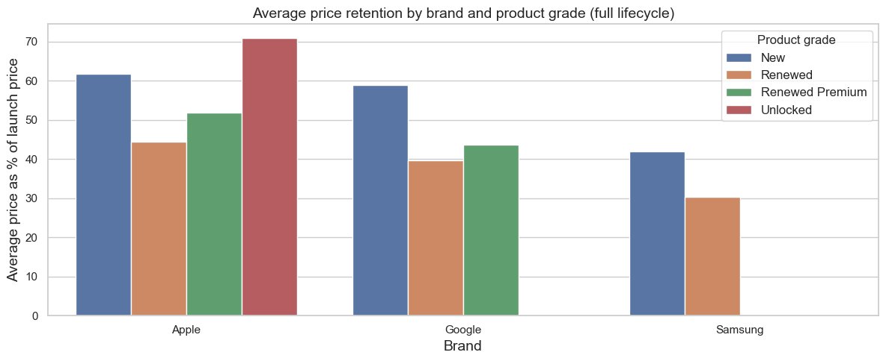
    


Różnica jest widoczna we wszystkich trzech markach:

- Apple: New utrzymuje 61,8% vs Renewed 44,4%. To 17 punktów procentowych.
- Samsung: New 42,0% vs Renewed 30,4%, różnica 12 pp.
- Google: New 58,8% vs Renewed 39,6%, różnica 19 pp.

Różnice są wyraźne, ale wyfiltrowanie klasy New oznaczałoby utratę około 90% danych Samsunga i 40% danych Google. W tej sytuacji nie mam zamiaru tego robić, ale będę pamiętać o tej różnicy przy interpretacji wyników.

---
## Przegląd projektu

Krótkie podsumowanie zbioru danych przed przejściem do analizy.


```python
kpi_data = [
    ['Price records', f"{df.shape[0]}"],
    ['Brands', 'Apple, Samsung, Google'],
    ['Generations tracked', str(df['generation_name'].nunique())],
    ['Years of data', '2019-2026'],
]

fig, ax = plt.subplots(figsize=(9, 2.5))
ax.axis('off')
table = ax.table(
    cellText=kpi_data,
    colLabels=['Metric', 'Value'],
    cellLoc='left',
    loc='center',
    colWidths=[0.5, 0.4]
)
table.auto_set_font_size(False)
table.set_fontsize(12)
table.scale(1, 2.2)

for (row, col), cell in table.get_celld().items():
    cell.set_edgecolor('#cccccc')
    if row == 0:
        cell.set_facecolor('#2c3e50')
        cell.set_text_props(color='white', fontweight='bold')
    elif row % 2 == 0:
        cell.set_facecolor('#f2f2f2')
    else:
        cell.set_facecolor('white')

plt.title('Project Overview', fontsize=14, pad=20)
plt.tight_layout()
plt.show()
```


    
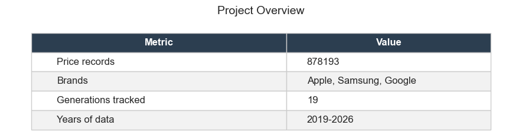
    


---
# Analiza spadku wartości

Każdy wykres poniżej pokazuje cenę jako procent oficjalnej ceny premierowej w czasie. 100% oznacza cenę równą cenie premierowej, 50% to utrata połowy wartości. Oś X pokazuje dni od premiery, dzięki czemu modele można porównywać w tym samym momencie cyklu niezależnie od daty wydania.

## Oficjalne ceny premierowe

Zanim przejdę do spadku wartości, warto zobaczyć, ile produkty kosztują na starcie.


```python
gen_lookup = df[['submodel_name', 'generation_name', 'brand']].drop_duplicates()
launch_ref = original_launch_ref.copy().merge(gen_lookup, on='submodel_name', how='left')

#Here I'm also adding the tier as it will be used later
#By tier I mean Base (as in base iPhone 11, Samsung Galaxy S23 etc.), Pro, Pro Max, +, Ultra etc.
launch_ref['tier'] = launch_ref.apply(
    lambda row: row['submodel_name'].replace(str(row['generation_name']), '').strip(), axis=1)
launch_ref['tier'] = launch_ref['tier'].replace('', 'Base')

#converting the date to a pandas datetime format
launch_ref['official_premiere_date'] = pd.to_datetime(launch_ref['official_premiere_date'])

#brand name fix for Pixel and Galaxy
launch_ref['brand'] = launch_ref['submodel_name'].str.split().str[0].replace(
    ['Pixel', 'Galaxy'], ['Google', 'Samsung'])

#sorting values based on their launch price in USD
launch_ref = launch_ref.sort_values('official_launch_price', ascending=False)

plt.subplots(figsize=(24, 10))
sns.barplot(data=launch_ref, x='submodel_name', y='official_launch_price', hue='brand')
plt.legend(loc='upper right', fontsize = 24)
plt.xticks(rotation = 90, fontsize = 18),
plt.yticks(fontsize = 18)
plt.xlabel('Model', fontsize = 24)
plt.ylabel('Launch price (USD)', fontsize = 20)
plt.title('Official launch prices by submodel', fontsize = 28)

plt.annotate(
    text = 'Way more expensive than other Google\'s products',
    xy = (0, 1820),
    xytext = (2, 1900),
    fontsize = 18,
    color = 'red',
    arrowprops = dict(arrowstyle = '->', color = 'red')
)

plt.axvspan(
    xmin = 49,
    xmax = 63,
    alpha = 0.25
)

plt.annotate(
    text = 'The budget zone',
    xy = (55, 600),
    xytext = (40, 1200),
    fontsize = 18,
    color = 'red',
    arrowprops = dict(arrowstyle = '->', color = 'red')
)

plt.axvspan(
    xmin = 1,
    xmax = 11,
    alpha = 0.25
)


plt.annotate(
    text = 'Samsung and Apple - the flagship zone',
    xy = (7, 1450),
    xytext = (14, 1500),
    fontsize = 18,
    color = 'red',
    arrowprops = dict(arrowstyle = '->', color = 'red')
)


plt.tight_layout()
plt.show()
```


    
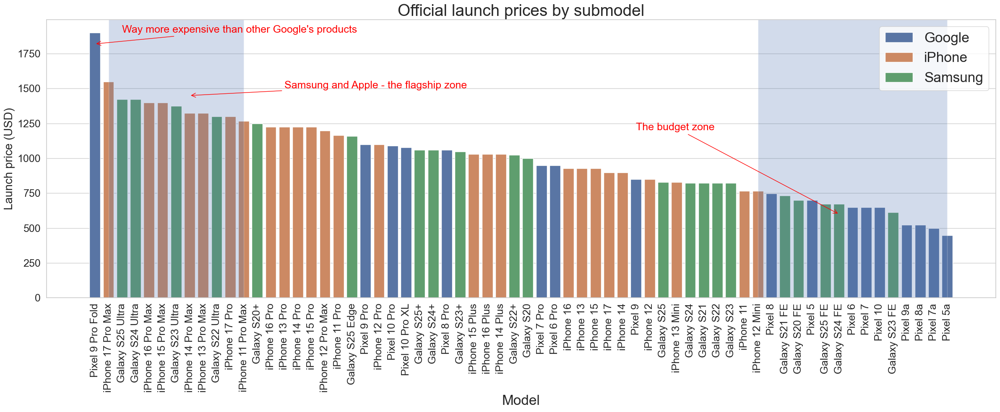
    


Uwaga: w gamie Google pojawia się model Pro Fold, który zajmuje pierwsze miejsce pod względem ceny (1799 USD). Najlepiej traktować go jednak jako model eksperymentalny a nie flagowca. Jego cena odzwierciedla złożoność i elastyczny wyświetlacz, ale są tam też pewne kompromisy pod kątem osiągów względem flagowców. Prawdziwym flagowcem Google pod względem parametrów jest Pixel Pro. 

W przeciwieństwie do Pro Folda, iPhone Pro Max i Samsung Galaxy Ultra to bezsporne flagowce w swoich markach.

Poniżej porównanie cen premierowych w czasie, z podziałem na modele bazowe i flagowce.


```python
base_launch_ref = launch_ref[launch_ref['tier'] == 'Base']
flagship_launch_ref = launch_ref[
    (launch_ref['tier'] == 'Pro Max') |
    (launch_ref['tier'] == 'Ultra') |
    (launch_ref['tier'] == 'Pro XL') |
    ((launch_ref['tier'] == 'Pro') & (launch_ref['brand'] == 'Google'))
]

plt.subplots(figsize=(14, 6))
sns.lineplot(data=base_launch_ref, x='official_premiere_date', y='official_launch_price',
    hue='brand', marker='o')
plt.legend(loc='upper right', fontsize=16)
plt.xlabel('Premiere year', fontsize=16)
plt.ylabel('Launch price in USD (mean of all memory sizes)', fontsize=16)
plt.title('Base model launch prices by brand over time', fontsize=20)
plt.tight_layout()
plt.show()

plt.subplots(figsize=(14, 6))
sns.lineplot(data=flagship_launch_ref, x='official_premiere_date', y='official_launch_price',
    hue='brand', marker='o')
plt.legend(loc='upper right', fontsize=16)
plt.xlabel('Premiere year', fontsize=16)
plt.ylabel('Launch price in USD (mean of all memory sizes)', fontsize=16)
plt.title('Flagship model launch prices by brand over time', fontsize=20)
plt.tight_layout()
plt.show()
```


    
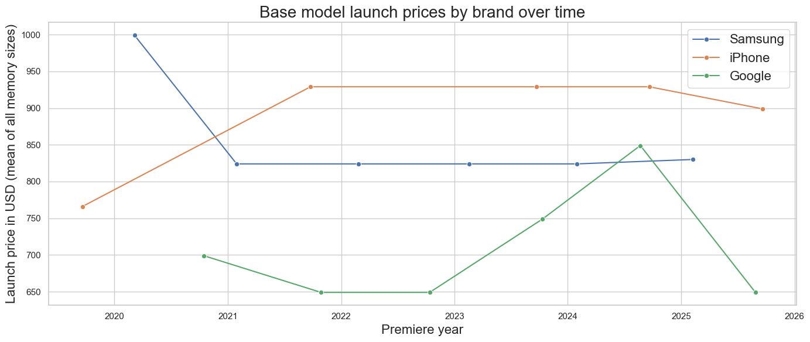
    


    
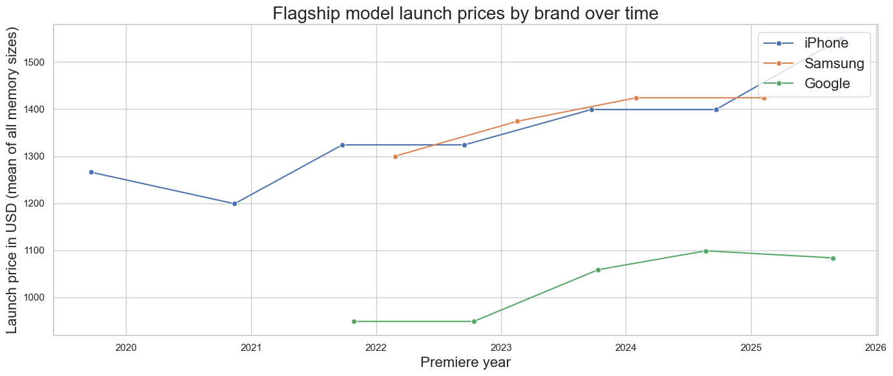
    


Google konsekwentnie pozycjonuje się jako najbardziej budżetowa marka. W obu tierach smartfony Google są średnio około 20% tańsze od konkurencji.

Samsung i Apple są bezpośrednimi rywalami w górnym segmencie rynku. Modele bazowe Apple są zazwyczaj około 10% droższe niż bazowe Samsungi, ale ta różnica znika na poziomie premium, gdzie modele Ultra Samsunga są wycenione niemal identycznie jak warianty Pro Max Apple'a.

---
## Wszystkie marki razem (modele bazowe)

Zaczynam od najbardziej ogólnego porównania uśrednionego spadku wartości dla wszystkich bazowych modeli (np. iPhone 11, iPhone 12 itd.) danej marki.


```python
base_combined_df = df[df['tier'] == 'Base']
all_brands_decay_df = base_combined_df.groupby(['brand', 'days_rounded'])['price_pct_of_launch'].mean().reset_index()

fig, ax = plt.subplots(figsize=(12, 6))
sns.lineplot(data=all_brands_decay_df, x='days_rounded', y='price_pct_of_launch', hue='brand', ax=ax)
ax.axhline(50, color='red', linestyle='dotted', linewidth=2)
ax.set_title('Price decay: all base models by brand', fontsize=16)
ax.set_xlabel('Days since launch', fontsize=16)
ax.set_ylabel('Price as % of launch price', fontsize=16)
plt.legend(loc = 'upper right', fontsize=16)
plt.tight_layout()

plt.axvspan(0, 365, alpha=0.05, color='green')
plt.axvspan(365, 730, alpha=0.15, color='green')
plt.axvspan(730, 1095, alpha=0.25, color='green')
plt.text(182, 105, 'Year 1', fontsize=14, color='darkgreen', ha='center')
plt.text(547, 105, 'Year 2', fontsize=14, color='darkgreen', ha='center')
plt.text(912, 105, 'Year 3', fontsize=14, color='darkgreen', ha='center')

plt.annotate('Samsung crosses 50% at ~500 days', xy=(530, 50), xytext=(850, 75),
    arrowprops=dict(arrowstyle='->', color='gray'), fontsize=12, color='red')
plt.annotate('Apple touches 50% at ~900 days', xy=(920, 50), xytext=(1100, 64),
    arrowprops=dict(arrowstyle='->', color='gray'), fontsize=12, color='red')
plt.annotate('Apple crosses 50% at ~1100 days', xy=(1100, 50), xytext=(1400, 55),
    arrowprops=dict(arrowstyle='->', color='gray'), fontsize=12, color='red')
plt.annotate('Google crosses 50% at ~420 days', xy=(420, 50), xytext=(650, 90),
    arrowprops=dict(arrowstyle='->', color='gray'), fontsize=12, color='red')
plt.show()
```


    
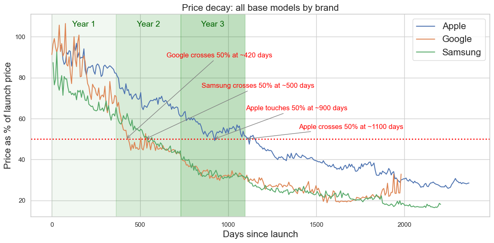
    


iPhone'y jako ostatnie spadają do 50% ceny premierowej, po raz pierwszy osiągając ten próg po około 900 dniach od premiery, a wyraźnie przekraczając ją po około 1100 dniach. Samsung osiąga ten poziom po około 500 dniach, Google po około 420 dniach. Apple ma też najwyższe ceny minimalne, które stabilizują się na poziomie 26-28% ceny premierowej po około 2000 dniach. Smartfony marki Samsung spadają do 16-17% a Google do około 20% ceny początkowej.

### Weryfikacja statystyczna

Wykres sugeruje wyraźne różnice między markami. Postanowiłem przeprowadzić testy statystyczne, żeby potwierdzić, że nie wynikają z losowości.

Wybór testu zależy od rozkładu danych. ANOVA zakłada rozkład normalny w każdej grupie. Jeśli dane nie będą miały rozkładu normalnego, użyję odpowiednika nieparametrycznego, czyli testu Kruskala-Wallisa.

Zaczynam od testu normalności.


```python
from scipy.stats import normaltest

for brand in df['brand'].unique():
    group = df[df['brand'] == brand]['price_pct_of_launch'].dropna()
    stat, p = normaltest(group)
    print(f"{brand}: p={p:.4f}")
```

    Apple: p=0.0000
    Google: p=0.0000
    Samsung: p=0.0000
    

Hipoteza zerowa: rozkład jest normalny.

Hipoteza alternatywna: rozkład nie jest normalny.

---

Wartości p poniżej 0,05 pozwalają odrzucić hipotezę zerową, co oznacza, że rozkłady nie są normalne.

Przechodzę zatem do testu Kruskala-Wallisa zamiast ANOVY.


```python
from scipy.stats import kruskal

apple = df['price_pct_of_launch'][df['brand'] == 'Apple'].sample(1000)
google = df['price_pct_of_launch'][df['brand'] == 'Google'].sample(1000)
samsung = df['price_pct_of_launch'][df['brand'] == 'Samsung'].sample(1000)

kruskal_result = kruskal(apple, google, samsung)
print(kruskal_result)
```

    KruskalResult(statistic=np.float64(69.10646295281046), pvalue=np.float64(9.856488916131548e-16))
    

Wartość p wynosi 9.85...e-10, czyli praktycznie zero, znacznie poniżej 0,05.

Oznacza to, że co najmniej jedna marka wykazuje statystycznie istotną różnicę względem pozostałych. Żeby sprawdzić, które pary się różnią, przeprowadzam test post-hoc Dunna.


```python
import scikit_posthocs as sp

posthoc_result = sp.posthoc_dunn(
                    df, 
                     val_col='price_pct_of_launch',
                     group_col='brand',
                     p_adjust='holm')

print(posthoc_result)
```

                Apple    Google  Samsung
    Apple    1.000000  0.000001      0.0
    Google   0.000001  1.000000      0.0
    Samsung  0.000000  0.000000      1.0
    

Wszystkie trzy porównania parami są statystycznie istotne (p < 0,001), co potwierdza, że każda marka traci wartość w zauważalnie innym tempie. Przy zbiorze tej wielkości spodziewałem się takich wyników, ale warto było to zweryfikować.

---
## Retencja wartości rok po premierze według marki i generacji

Zamiast pełnych krzywej deprecjacji dla każdej generacji z osobna, robię migawkę około 365 dni od premiery i porównuję wszystkie generacje w obrębie danej marki. To w czytelny sposób da odpowiedź, które modele najlepiej utrzymują wartość po pierwszym roku.


```python
retention_1yr_df = df[(df['days_rounded'] > 330) & (df['days_rounded'] < 380)]
retention_1yr_df = retention_1yr_df.groupby(['generation_name', 'brand']).agg(
    price_retention=('price_pct_of_launch', 'mean')
).reset_index()

for brand in ['Apple', 'Samsung', 'Google']:
    brand_df = retention_1yr_df[retention_1yr_df['brand'] == brand].sort_values('price_retention', ascending=False)
    fig, ax = plt.subplots(figsize=(14, 6))
    sns.barplot(
        data=brand_df,
        x='generation_name',
        y='price_retention',
        hue = 'generation_name',
        ax=ax
        )
    ax.set_title(f'{brand}: 1-year price retention by generation', fontsize = 24)
    ax.set_xlabel('Generation', fontsize = 16)
    ax.set_ylabel('Price retention (%)', fontsize = 16)
    ax.set_ylim(0, 110)
    plt.xticks(rotation=35, ha='right')
    plt.tight_layout()
    plt.show()
```


    
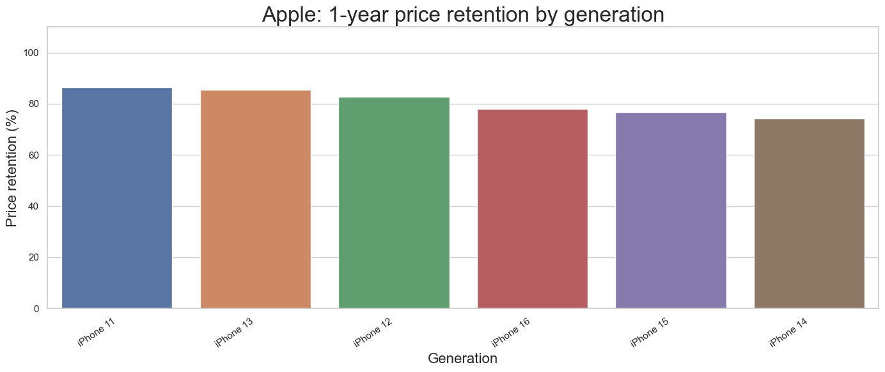
    


    
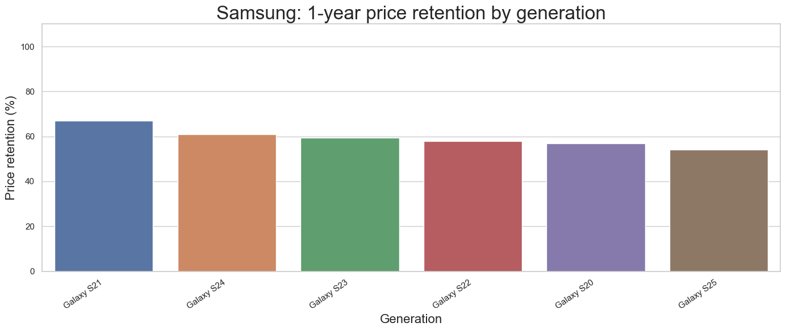
    


    
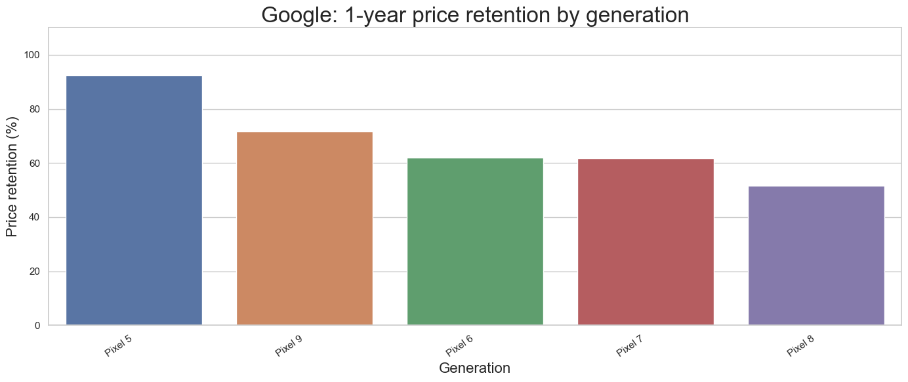
    


Generacje Apple skupiają się blisko 80% rok po premierze, co świadczy o dość spójnej retencji w całej linii. Samsung pokazuje podobny rozrzut w okolicach 55-60%. Pixel 5 to wyraźna anomalia wśród telefonów Google, utrzymując wartość na poziomie zbliżonym do iPhone'ów. Pozostałe Pixele oscylują w okolicach 50-60%.

Pixel 5 zadebiutował w stosunkowo niskiej cenie i Google wycofał go wcześniej niż planowano, co ograniczyło podaż i być może dlatego cena na rynku wtórnym utrzymała się wyżej.

---
## W obrębie generacji: submodele iPhone'a 13

Do tej pory patrzyłem tylko na modele bazowe. Czas zejść poziom niżej i porównać tiery Base i Pro Max w obrębie jednej generacji.


```python
iphone13_decay_df = df[(df['generation_name'] == 'iPhone 13') & (df['tier'].isin(['Base', 'Pro Max']))].groupby(
    ['submodel_name', 'days_rounded'])['price_pct_of_launch'].mean().reset_index()

fig, ax = plt.subplots(figsize=(14, 6))
sns.lineplot(data=iphone13_decay_df, x='days_rounded', y='price_pct_of_launch',
    hue='submodel_name', ax=ax)
ax.axhline(50, color='red', linestyle='dotted', linewidth=2)
ax.set_title('Price decay: iPhone 13 Pro Max vs Base', fontsize = 16)
ax.set_xlabel('Days since launch', fontsize = 16)
ax.set_ylabel('Price as % of launch price', fontsize = 16)
plt.legend(loc = 'upper right', fontsize = 16)
plt.tight_layout()
plt.show()
```


    
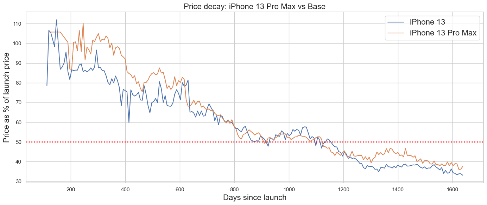
    


Pro Max przez większość historii ceny utrzymuje wartość nieco lepiej od modelu bazowego. Zachowuje około 40% ceny premierowej nawet po 1600 dniach. Zdarzają się momenty, gdy model bazowy wypada lepiej, ale ogólnie Pro Max nieco lepiej zachowuje cenę w tej generacji.

---
## Spadek wartości według tierów

Teraz porównuję wszystkie tiery we wszystkich generacjach dla każdej marki. To daje czytelniejszy obraz tego, czy droższe warianty utrzymują wartość lepiej czy gorzej od bazowych.


```python
all_brands_tier_df = df.groupby(['brand', 'tier', 'days_rounded'])['price_pct_of_launch'].mean().reset_index()
apple_tier_df = all_brands_tier_df[(all_brands_tier_df['brand'] == 'Apple') 
                                   & (all_brands_tier_df['tier'].isin(['Base', 'Pro Max']))]

plt.subplots(figsize=(14, 6))
sns.lineplot(apple_tier_df, x='days_rounded', y='price_pct_of_launch', hue='tier')
plt.legend(loc='upper right', fontsize = 16)
plt.title('Relative price decay across Apple tiers (Base vs Pro Max)', fontsize = 16)
plt.xlabel('Days since launch', fontsize = 16)
plt.ylabel('% of launch price', fontsize = 16)
plt.tight_layout()

plt.axhline(50, color='red', linestyle='dotted', linewidth=2)

plt.axvspan(0, 365, alpha=0.05, color='green')
plt.axvspan(365, 730, alpha=0.15, color='green')
plt.axvspan(730, 1095, alpha=0.25, color='green')
plt.text(182, 115, 'Year 1', fontsize=14, color='darkgreen', ha='center')
plt.text(547, 115, 'Year 2', fontsize=14, color='darkgreen', ha='center')
plt.text(912, 115, 'Year 3', fontsize=14, color='darkgreen', ha='center')
plt.show()


apple_tier_df['year'] = pd.cut(apple_tier_df['days_rounded'],
    bins=[0, 365, 730, 1095, 9999], labels=['Year 1', 'Year 2', 'Year 3', 'Year 4+'])
apple_heat_df = apple_tier_df.groupby(['tier', 'year'], observed=True)['price_pct_of_launch'].mean().round(1).unstack()

fig, ax = plt.subplots(figsize=(14, 8))
sns.heatmap(apple_heat_df, annot=True, fmt='.1f', cmap='RdYlGn', vmin=20, vmax=100,
    linewidths=0.5, ax=ax, annot_kws={'size': 13})
ax.set_title('Apple: price retention by tier and year', fontsize = 16)
ax.set_xlabel('Period after launch', fontsize = 16)
ax.set_ylabel('Tier', fontsize = 16)
plt.tight_layout()
plt.show()

```


    
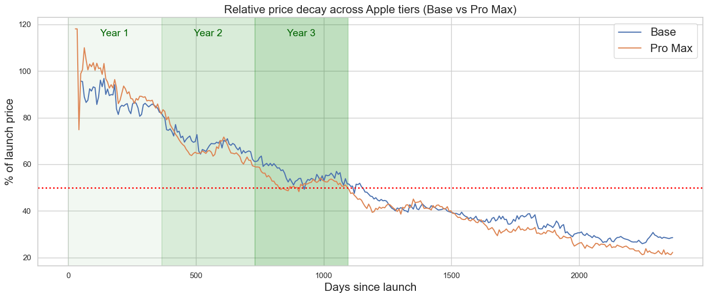
    


    
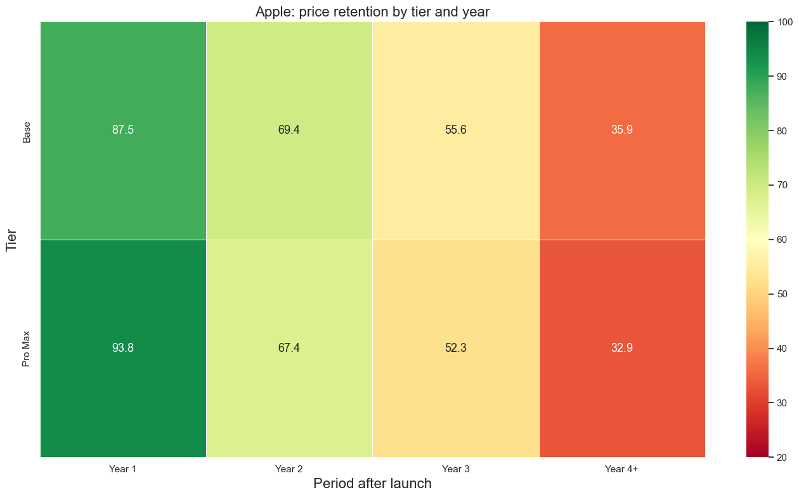
    


Wbrew temu, czego można by się spodziewać na podstawie wykresu iPhone'a 13, przy porównaniu wszystkich generacji wychodzi na to, że to model bazowy w dłuższej perspektywie wykazuje najwyższą stabilność cenową.


```python
samsung_tier_df = all_brands_tier_df[(all_brands_tier_df['brand'] == 'Samsung') 
                                     & (all_brands_tier_df['tier'].isin(['Base', 'Ultra', 'Edge']))]

plt.subplots(figsize=(14, 6))
sns.lineplot(samsung_tier_df, x='days_rounded', y='price_pct_of_launch', hue='tier')
plt.title('Relative price decay across Samsung tiers (Base, Edge, Ultra)', fontsize = 16)
plt.xlabel('Days since launch', fontsize = 16)
plt.ylabel('% of launch price', fontsize = 16)
plt.legend(loc='upper right', fontsize = 16)
plt.tight_layout()

plt.axhline(50, color='red', linestyle='dotted', linewidth=2)

plt.axvspan(0, 365, alpha=0.05, color='green')
plt.axvspan(365, 730, alpha=0.15, color='green')
plt.axvspan(730, 1095, alpha=0.25, color='green')
plt.text(182, 102, 'Year 1', fontsize=14, color='darkgreen', ha='center')
plt.text(547, 102, 'Year 2', fontsize=14, color='darkgreen', ha='center')
plt.text(912, 102, 'Year 3', fontsize=14, color='darkgreen', ha='center')
plt.show()

samsung_tier_df['year'] = pd.cut(samsung_tier_df['days_rounded'],
    bins=[0, 365, 730, 1095, 9999], labels=['Year 1', 'Year 2', 'Year 3', 'Year 4+'])
samsung_heat_df = samsung_tier_df.groupby(['tier', 'year'], observed=True)['price_pct_of_launch'].mean().round(1).unstack()

fig, ax = plt.subplots(figsize=(14, 8))
sns.heatmap(samsung_heat_df, annot=True, fmt='.1f', cmap='RdYlGn', vmin=20, vmax=100,
    linewidths=0.5, ax=ax, annot_kws={'size': 13})
ax.set_title('Samsung: price retention by tier and year', fontsize = 16)
ax.set_xlabel('Period after launch', fontsize = 16)
ax.set_ylabel('Tier', fontsize = 16)
plt.tight_layout()
plt.show()


```


    
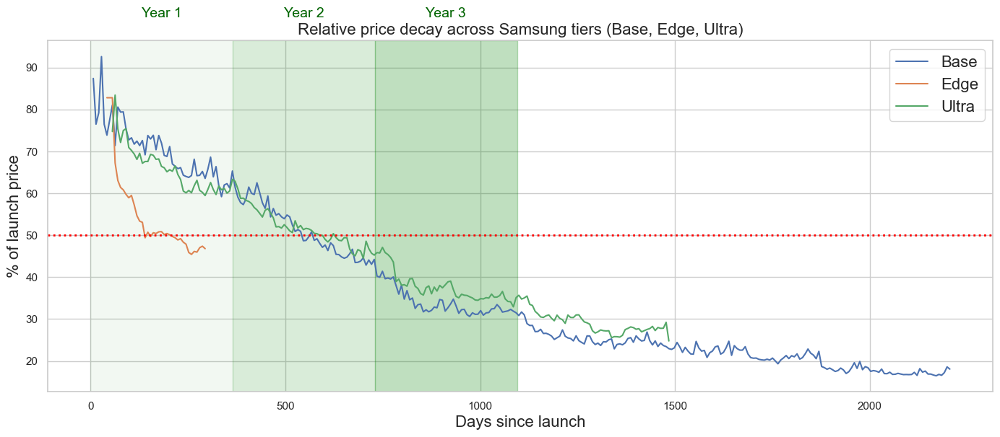
    


    
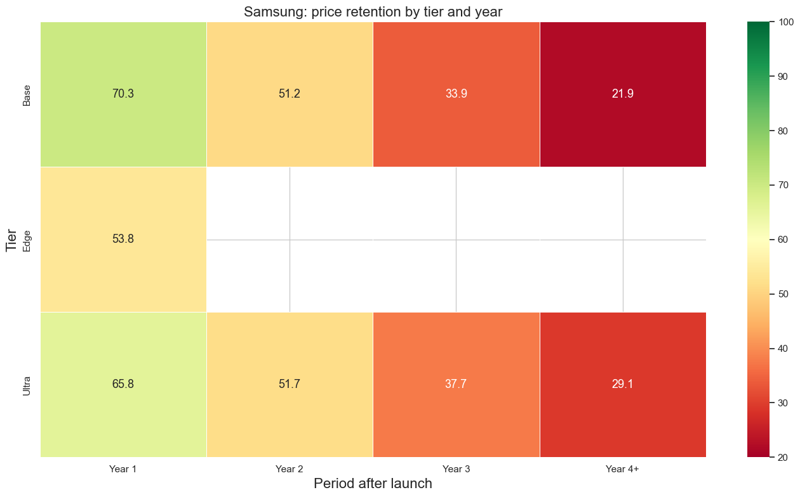
    


Samsung przechodzi przez wyraźne fazy:
1. Model bazowy prowadzi w pierwszym roku. 
2. Około 500. dnia Ultra przejmuje prowadzenie i utrzymuje je do końca dostępnych danych.

Model Edge wyróżnia się wyjątkowo gwałtownym spadkiem, prawdopodobnie przez wysokie koszty napraw i obawy o trwałość ekranu wśród kupujących na rynku wtórnym, a także przez utratę znaczenia w momencie, gdy Samsung skupił się na serii Ultra.


```python
google_tier_df = all_brands_tier_df[(all_brands_tier_df['brand'] == 'Google')
                                    & ((all_brands_tier_df['tier'].isin(['Base', 'Pro', 'Pro Fold', 'a'])))]

plt.subplots(figsize=(14, 6))
sns.lineplot(google_tier_df, x='days_rounded', y='price_pct_of_launch', hue='tier')
plt.title('Relative price decay across Google tiers (Base, Pro, Pro Fold)', fontsize=16)
plt.xlabel('Days since launch', fontsize=16)
plt.ylabel('% of launch price', fontsize=16)
plt.legend(loc='upper right', fontsize=16)
plt.tight_layout()

plt.axhline(50, color='red', linestyle='dotted', linewidth=2)

plt.axvspan(0, 365, alpha=0.05, color='green')
plt.axvspan(365, 730, alpha=0.15, color='green')
plt.axvspan(730, 1095, alpha=0.25, color='green')
plt.text(182, 105, 'Year 1', fontsize=16, color='darkgreen', ha='center')
plt.text(547, 105, 'Year 2', fontsize=16, color='darkgreen', ha='center')
plt.text(912, 105, 'Year 3', fontsize=16, color='darkgreen', ha='center')

plt.show()


google_tier_df['year'] = pd.cut(google_tier_df['days_rounded'],
    bins=[0, 365, 730, 1095, 9999], labels=['Year 1', 'Year 2', 'Year 3', 'Year 4+'])
google_heat_df = google_tier_df.groupby(['tier', 'year'], observed=True)['price_pct_of_launch'].mean().round(1).unstack()

fig, ax = plt.subplots(figsize=(14, 8))
sns.heatmap(google_heat_df, annot=True, fmt='.1f', cmap='RdYlGn', vmin=20, vmax=100,
    linewidths=0.5, ax=ax, annot_kws={'size': 13})
ax.set_title('Google: price retention by tier and year', fontsize = 16)
ax.set_xlabel('Period after launch', fontsize = 16)
ax.set_ylabel('Tier', fontsize = 16)
plt.tight_layout()
plt.show()


```


    
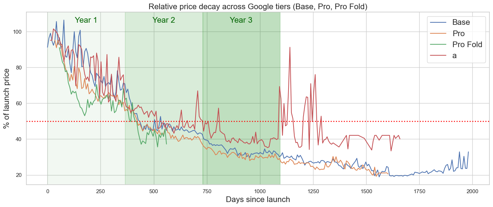
    


    
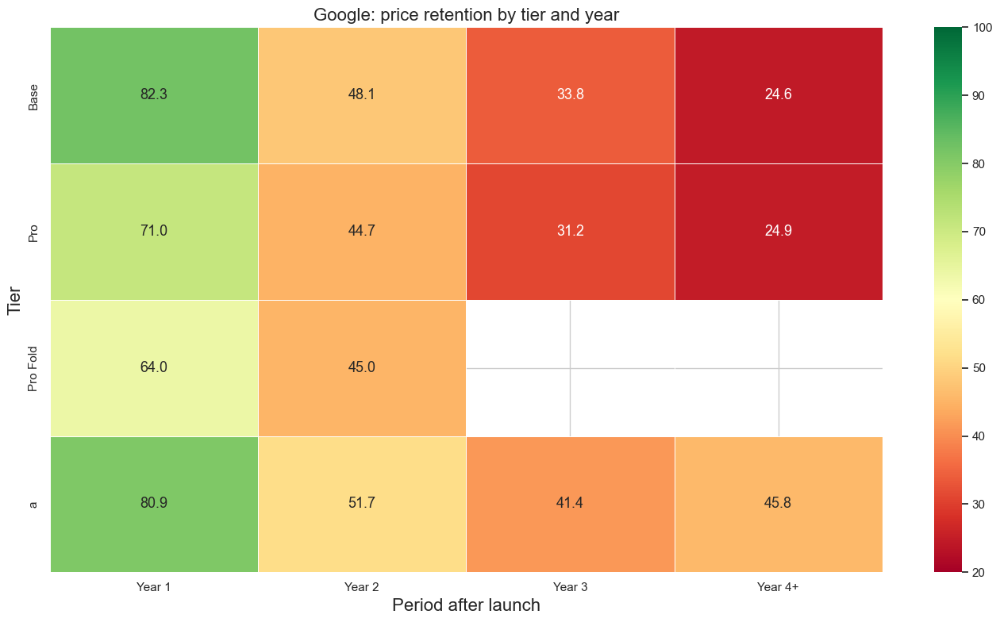
    


Google pokazuje największą polaryzację między tierami. Budżetowa seria 'a' to lider retencji wartości, choć z wyraźnie dużą zmiennością. 

Model Pro Fold wykazuje jedną z najgwałtowniejszych deprecjacji w całym zbiorze.

---
## Spadek cen w dolarach

Procenty to jedno, ale wartości w USD dają bardziej konkretny punkt odniesienia dla osoby potencjalnie zainteresowanej zakupem danego smartfona. Poniższe wykresy pokazują, ile faktycznie kosztuje dana marka w różnych momentach. Ceny są uśrednione po wszystkich generacjach, rozmiarach pamięci i kolorach.


```python
dollar_all_brands_df = df.groupby(['brand', 'days_rounded'])['NEW'].mean().reset_index()

plt.subplots(figsize=(14, 6))
sns.lineplot(data=dollar_all_brands_df, x='days_rounded', y='NEW', hue='brand')
plt.title('Price decay in USD: all brands (mean)', fontsize = 16)
plt.xlabel('Days since launch', fontsize = 16)
plt.ylabel('Price in USD', fontsize = 16)
plt.legend(loc='upper right', fontsize = 16)

plt.axhline(1000, color='red', linestyle='dotted', linewidth=2)
plt.axhline(500, color='red', linestyle='dotted', linewidth=2)

plt.tight_layout()

plt.axvspan(0, 365, alpha=0.05, color='green')
plt.axvspan(365, 730, alpha=0.15, color='green')
plt.axvspan(730, 1095, alpha=0.25, color='green')
plt.text(182, 1450, 'Year 1', fontsize=14, color='darkgreen', ha='center')
plt.text(547, 1450, 'Year 2', fontsize=14, color='darkgreen', ha='center')
plt.text(912, 1450, 'Year 3', fontsize=14, color='darkgreen', ha='center')

plt.show()
```


    
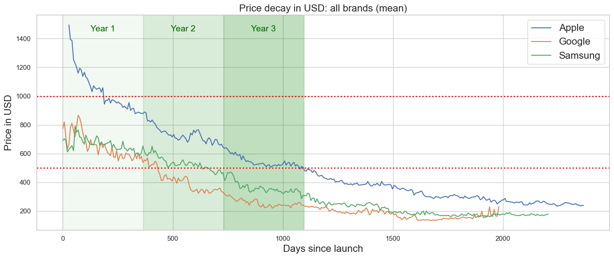
    


Apple utrzymuje stałą premię cenową rzędu 200-400 USD nad konkurencją przez cały cykl. W pewnych momentach iPhone'y są nawet o 100% droższe od konkurencji. Średnia cena minimalna iPhone'a stabilizuje się w okolicach 200-300 USD. 

Google i Samsung startują na podobnym poziomie, czyli około 700-800 USD. Po pierwszym roku Samsung trzyma wartość nieco lepiej, utrzymując stabilną przewagę około 100 USD nad Google przez resztę cyklu.

#### Porównanie tierów w dolarach


```python
apple_dollar_df = df[(df['brand'] == 'Apple') & (df['tier'].isin(['Base', 'Pro Max']))].groupby(['tier', 'days_rounded'])['NEW'].mean().reset_index()

plt.subplots(figsize=(14, 6))
sns.lineplot(data=apple_dollar_df, x='days_rounded', y='NEW', hue='tier')
plt.title('Price decay in USD: iPhone tiers (Base vs Pro Max)', fontsize=14)
plt.xlabel('Days since launch', fontsize=14)
plt.ylabel('Price in USD', fontsize=14)
plt.legend(loc='upper right', fontsize=14)

plt.axhline(1000, color='red', linestyle='dotted', linewidth=2) #horizontal lines for 500/1000 USD marks
plt.axhline(500, color='red', linestyle='dotted', linewidth=2)


plt.tight_layout()
plt.axvspan(0, 365, alpha=0.05, color='green')
plt.axvspan(365, 730, alpha=0.15, color='green')
plt.axvspan(730, 1095, alpha=0.25, color='green')

plt.text(182, 1700, 'Year 1', fontsize=14, color='darkgreen', ha='center') #YEARLY vertical spans for years
plt.text(547, 1700, 'Year 2', fontsize=14, color='darkgreen', ha='center')
plt.text(912, 1700, 'Year 3', fontsize=14, color='darkgreen', ha='center')

plt.annotate(
    text = 'The Pro Max crosses the 1000 USD mark after 410~ days',
    xy = (410, 1000),
    xytext= (410, 1200),
    arrowprops=dict(arrowstyle='->', color='gray'), fontsize=12, color='red'
    )

plt.annotate(
    text = 'The base version crosses the 500 USD mark after 820~ days',
    xy = (820, 500),
    xytext= (800, 803),
    arrowprops=dict(arrowstyle='->', color='gray'), fontsize=12, color='red'
    )

plt.annotate(
    text = 'The Pro Max crosses the 500 USD mark after 1500~ days',
    xy = (1500, 500),
    xytext= (1500, 650),
    arrowprops=dict(arrowstyle='->', color='gray'), fontsize=12, color='red'
    )


plt.show()


```


    
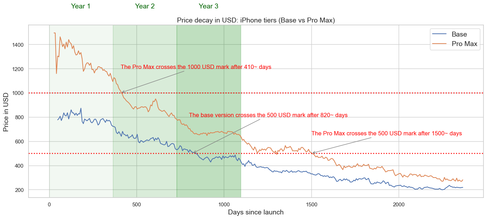
    


Na premierze Pro Max jest droższy od modelu bazowego o ponad 600 USD (około 75%). Ta różnica szybko się kurczy: w pierwszym roku Pro Max traci średnio około 30% ceny, schodząc poniżej 1000 USD niedługo po tym, podczas gdy model bazowy traci tylko około 10% ceny. 

Redukuje to pierwotną premię Pro Maxa mniej więcej o połowę, do poziomu około 400 USD. Ta różnica kurcyz się do 250-300 USD i utrzymuje się dość stabilnie przez kolejne dwa lata. Po 2000 dniach Pro Max stabilizuje się blisko 280 USD, a model bazowy blisko 200 USD.


```python
samsung_dollar_df = df[(df['brand'] == 'Samsung') & (df['tier'].isin(['Base', 'Ultra', 'Edge']))].groupby(['tier', 'days_rounded'])['NEW'].mean().reset_index()

plt.subplots(figsize=(14, 6))
sns.lineplot(data=samsung_dollar_df, x='days_rounded', y='NEW', hue='tier')
plt.title('Price decay in USD: Samsung tiers (Base vs Ultra vs Edge)', fontsize=14)
plt.xlabel('Days since launch', fontsize=14)
plt.ylabel('Price in USD', fontsize=14)

plt.axhline(1000, color='red', linestyle='dotted', linewidth=2) #horizontal lines for 1000 USD and 500 USD mark
plt.axhline(500, color='red', linestyle='dotted', linewidth=2)

plt.legend(loc='upper right', fontsize=16)
plt.tight_layout()

plt.axvspan(0, 365, alpha=0.05, color='green') #YEARLY vertical spans for years
plt.axvspan(365, 730, alpha=0.15, color='green')
plt.axvspan(730, 1095, alpha=0.25, color='green')
plt.text(182, 1250, 'Year 1', fontsize=14, color='darkgreen', ha='center')
plt.text(547, 1250, 'Year 2', fontsize=14, color='darkgreen', ha='center')
plt.text(912, 1250, 'Year 3', fontsize=14, color='darkgreen', ha='center')

plt.annotate(
    text = 'Samsung Ultra crosses the 1000 USD mark after 85~ days',
    xy = (85, 1000),
    xytext= (200, 1100),
    arrowprops=dict(arrowstyle='->', color='gray'), fontsize=12, color='red'
    )

plt.annotate(
    text = 'Samsung Ultra crosses the 500 USD mark after 820~ days',
    xy = (820, 500),
    xytext= (1000, 603),
    arrowprops=dict(arrowstyle='->', color='gray'), fontsize=12, color='red'
    )

plt.annotate(
    text = 'The base version crosses the 500 USD mark after 370~ days',
    xy = (370, 500),
    xytext= (450, 800),
    arrowprops=dict(arrowstyle='->', color='gray'), fontsize=12, color='red'
    )

plt.show()
```


    
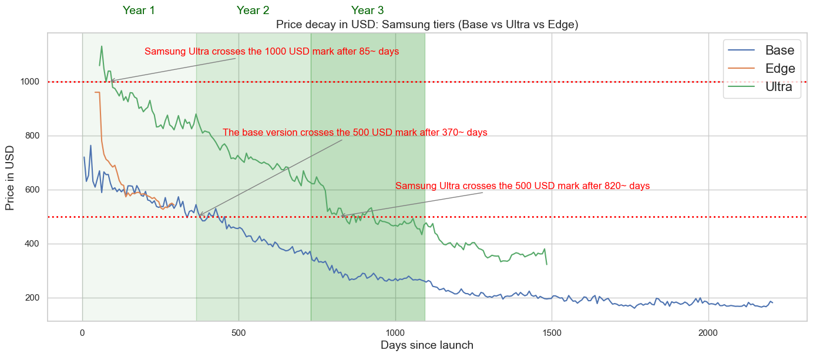
    


Edge startuje w okolicach 950 USD i gwałtownie traci wartość, zrównując się z modelem bazowym już po upływie około 150-180 dni. 

Ultra zaczyna z ceną około 1150 USD i spada poniżej 1000 USD w ciągu kilku miesięcy, stabilizując się na poziomie 850-900 USD po pierwszym roku. Premia cenowa nad modelem bazowym zanika powoli i utrzymuje się na dość stabilnym poziomie 200-300 USD aż do końca dostępnych danych.


```python
google_dollar_df = df[(df['brand'] == 'Google') & (df['tier'].isin(['Base', 'Pro', 'Pro Fold']))].groupby(['tier', 'days_rounded'])['NEW'].mean().reset_index()

plt.subplots(figsize=(14, 6))
sns.lineplot(data=google_dollar_df, x='days_rounded', y='NEW', hue='tier')
plt.title('Price decay in USD: Google tiers (Base vs Pro vs Pro Fold)', fontsize = 14)
plt.xlabel('Days since launch', fontsize = 14)
plt.ylabel('Price in USD', fontsize = 14)

plt.axhline(1000, color='red', linestyle='dotted', linewidth=2) #horizontal lines for 500/1000 USD marks
plt.axhline(500, color='red', linestyle='dotted', linewidth=2)

plt.legend(loc='upper right', fontsize=14)
plt.tight_layout()

plt.axvspan(0, 365, alpha=0.05, color='green') #YEARLY vertical spans for years
plt.axvspan(365, 730, alpha=0.15, color='green')
plt.axvspan(730, 1095, alpha=0.25, color='green')
plt.text(182, 1700, 'Year 1', fontsize=14, color='darkgreen', ha='center')
plt.text(547, 1700, 'Year 2', fontsize=14, color='darkgreen', ha='center')
plt.text(912, 1700, 'Year 3', fontsize=14, color='darkgreen', ha='center')

#annotations
plt.annotate(
    text = 'The Pro Fold crosses the 1000 USD mark after 400~ days',
    xy = (400, 1000),
    xytext= (410, 1200),
    arrowprops=dict(arrowstyle='->', color='gray'), fontsize=12, color='red'
    )

plt.annotate(
    text = 'The Pro version crosses the 500 USD mark after 420~ days',
    xy = (420, 500),
    xytext= (800, 550),
    arrowprops=dict(arrowstyle='->', color='gray'), fontsize=12, color='red'
    )

plt.annotate(
    text = 'The base version crosses the 500 USD mark after 200~ days',
    xy = (200, 500),
    xytext= (600, 850),
    arrowprops=dict(arrowstyle='->', color='gray'), fontsize=12, color='red'
    )


plt.show()
```


    
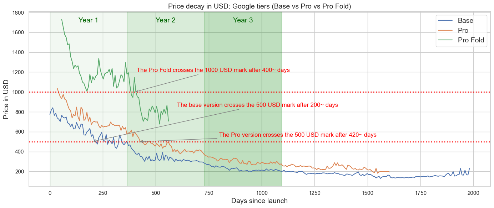
    


Pro Fold startuje przy 1700 USD i traci ponad 50% wartości w ciągu 500 dni, co czyni go najszybciej tracącym wartość modelem w całym zbiorze.

Modele Base i Pro są wyjątkowo blisko siebie, zaczynając z różnicą zaledwie 200-250 USD, która zawęża się do poniżej 100 USD po pierwszym roku.

---
## Rozkład cen przez cały cykl

Boxplot poniżej pokazuje pełny rozkład cen przez cały cykl dla każdej marki: medianę, kwartyle i outliery. Daje to obraz zmienności cen w obrębie każdej marki, zamiast samej średniej.


```python
base_combined_df = df[df['tier'] == 'Base']
all_brands_decay_df = base_combined_df.groupby(['brand', 'days_rounded'])['price_pct_of_launch'].mean().reset_index()

plt.subplots(figsize = (14, 6))
sns.boxplot(data=all_brands_decay_df, x='brand', y='price_pct_of_launch', hue='brand')
plt.title('Price distribution across full lifecycle by brand')
plt.xlabel('Brand')
plt.ylabel('Price as % of launch price')
plt.tight_layout()
plt.show()
```


    
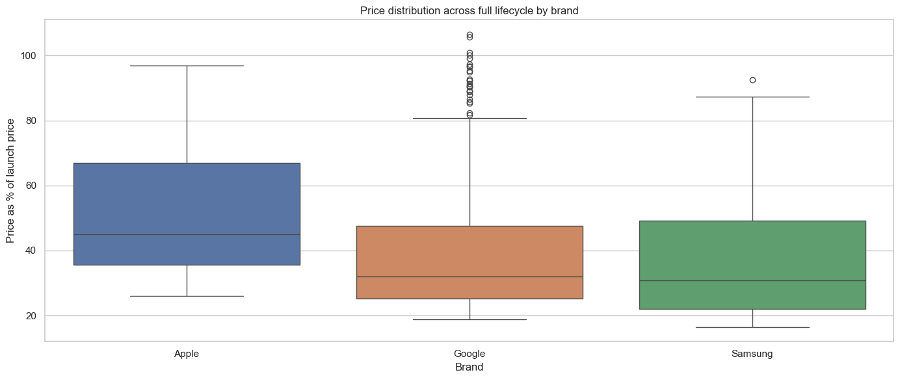
    


Apple wyraźnie prowadzi pod względem mediany, a IQR jest przesunięty wyżej niż u konkurencji. 

Google i Samsung mają podobne do siebie rozkłady, ale marka Google ma też najwyższą liczbę outlierów spośród trzech marek.

---
## Pipeline danych sprzedażowych

Po analizie spadku cen chcę przyjrzeć się również danym sprzedażowym.

### Krok 1: Czyszczenie i przygotowanie

Łączę dane sprzedażowe z tabelą referencyjną (original_launch_ref), żeby uzyskać daty premier i wyciągam nazwy tierów, stosując tę samą logikę co przy danych cenowym.


```python
ms_df = ms_df.merge(original_launch_ref, on='submodel_name', how='left')
ms_df['official_premiere_date'] = pd.to_datetime(ms_df['official_premiere_date'])
ms_df['datetime'] = pd.to_datetime(ms_df['datetime'])
del ms_df['premiere_date']

ms_df['days_since_launch'] = (ms_df['datetime'] - ms_df['official_premiere_date']).dt.days
ms_df['days_rounded'] = (ms_df['days_since_launch'] / 7).round() * 7
ms_df = ms_df[ms_df['days_since_launch'] >= 0]

ms_df['tier'] = ms_df.apply(lambda row: row['submodel_name'].replace(row['generation_name'], '').strip(), axis=1)
ms_df['tier'] = ms_df['tier'].replace('', 'Base')

print(f"Sales rows after cleaning: {ms_df.shape[0]:,}")
ms_df[['asin', 'submodel_name', 'tier', 'datetime', 'monthly_sold']].head(8)
```

    Sales rows after cleaning: 17,938
    


<div>
<style scoped>
    .dataframe tbody tr th:only-of-type {
        vertical-align: middle;
    }

    .dataframe tbody tr th {
        vertical-align: top;
    }

    .dataframe thead th {
        text-align: right;
    }
</style>
<table border="1" class="dataframe">
  <thead>
    <tr style="text-align: right;">
      <th></th>
      <th>asin</th>
      <th>submodel_name</th>
      <th>tier</th>
      <th>datetime</th>
      <th>monthly_sold</th>
    </tr>
  </thead>
  <tbody>
    <tr>
      <th>0</th>
      <td>B011SDYBZW</td>
      <td>iPhone 11</td>
      <td>Base</td>
      <td>2023-10-20 07:04:00</td>
      <td>50</td>
    </tr>
    <tr>
      <th>1</th>
      <td>B011SDYBZW</td>
      <td>iPhone 11</td>
      <td>Base</td>
      <td>2023-11-28 13:34:00</td>
      <td>100</td>
    </tr>
    <tr>
      <th>2</th>
      <td>B011SDYBZW</td>
      <td>iPhone 11</td>
      <td>Base</td>
      <td>2024-01-01 08:42:00</td>
      <td>50</td>
    </tr>
    <tr>
      <th>3</th>
      <td>B011SDYBZW</td>
      <td>iPhone 11</td>
      <td>Base</td>
      <td>2024-01-01 18:16:00</td>
      <td>100</td>
    </tr>
    <tr>
      <th>4</th>
      <td>B011SDYBZW</td>
      <td>iPhone 11</td>
      <td>Base</td>
      <td>2024-01-02 14:56:00</td>
      <td>50</td>
    </tr>
    <tr>
      <th>5</th>
      <td>B07ZPJ58KN</td>
      <td>iPhone 11</td>
      <td>Base</td>
      <td>2023-10-20 00:52:00</td>
      <td>100</td>
    </tr>
    <tr>
      <th>6</th>
      <td>B07ZPJ58KN</td>
      <td>iPhone 11</td>
      <td>Base</td>
      <td>2023-11-26 05:26:00</td>
      <td>200</td>
    </tr>
    <tr>
      <th>7</th>
      <td>B07ZPJ58KN</td>
      <td>iPhone 11</td>
      <td>Base</td>
      <td>2023-12-06 10:06:00</td>
      <td>100</td>
    </tr>
  </tbody>
</table>
</div>


### Krok 2: Resample i agregacja

Ponieważ `monthly_sold` jest aktualizowany kilka razy w ciągu miesiąca, pobieram ostatni odczyt każdego miesiąca dla każdego ASIN-u przez `resample('ME').last()`. Pozwala to uniknąć wielokrotnego liczenia pośrednich aktualizacji.

Następnie sumuję wyniki po ASIN-ach zamiast uśredniać. Uśrednianie niedoszacowałoby aktywności modeli z większą liczbą wariantów (np. iPhone 16 Pro ma 23 ASIN-y, Galaxy S22 ma 8). Sumowanie daje dolną granicę zakresu, którą będzie można porównać między modelami.

Keepa śledzi te dane konsekwentnie dopiero od końca 2023 roku, więc mamy dane z około 2.5 roku (pobierałem dane w lutym 2026).


```python
new_ms_df = ms_df.copy().set_index(ms_df['datetime'])
new_ms_df = new_ms_df.groupby('asin').resample('ME').last()
new_ms_df = new_ms_df[(new_ms_df['submodel_name'].notna()) & (new_ms_df['monthly_sold'] >= 0)]
new_ms_df['month_year'] = new_ms_df['datetime'].dt.to_period('M').dt.to_timestamp()

print(f"Months covered: {new_ms_df['month_year'].nunique()}")
print(f"ASINs tracked: {new_ms_df.index.get_level_values('asin').nunique()}")
```

    Months covered: 31
    ASINs tracked: 362
    

---
## Miesięczna sprzedaż według marki

Zaczynam od najbardziej ogólnego widoku, który pokazuje łączny wskaźnik sprzedaży każdej marki co miesiąc.


```python
brand_ms_df = new_ms_df.groupby(['brand', 'month_year'])['monthly_sold'].sum().reset_index()

plt.subplots(figsize=(14, 6))
sns.lineplot(data=brand_ms_df, x='month_year', y='monthly_sold', hue='brand')
plt.title('Monthly sales indicator by brand', fontsize=16)
plt.ylabel('Monthly sales (indicator, not a precise amount)', fontsize=16)
plt.xlabel('Date', fontsize=16)
plt.legend(loc='upper right', fontsize=16)
plt.tight_layout()
plt.show()
```


    
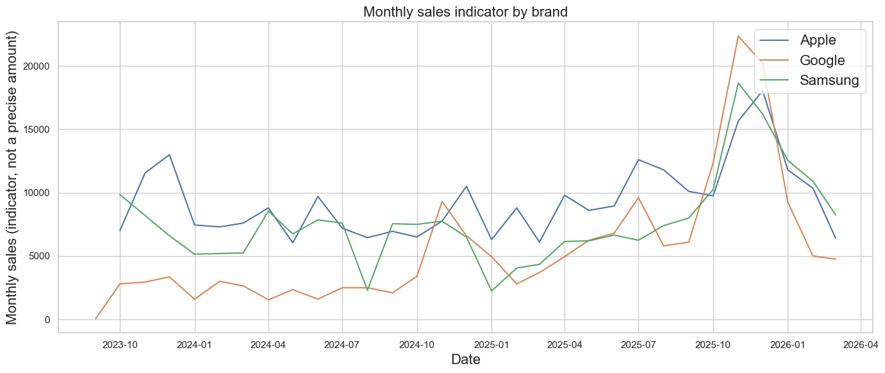
    


Apple prowadzi, choć różnice nie są duże i marka często szła łeb w łeb z Samsungiem. Google zanotował pierwszy większy skok w Q4 2024, potem w lipcu 2025 i Q4 2025. Wszystkie trzy marki notują wyraźny wzrost w Q4 2025. Google i Apple rosną też w lipcu 2025, czyli mniej więcej wtedy, gdy na Amazonie odbywa się tzw. Prime Day (coroczny festiwal okazji).

---
## Miesięczna sprzedaż według tierów

Rozkład na tiery w każdej marce pozwala zobaczyć, które tiery napędzają popyt na rynku wtórnym.


```python
brand_tier_ms_df = new_ms_df.groupby(['brand', 'tier', 'month_year'])['monthly_sold'].sum().reset_index()

apple_ms_df = brand_tier_ms_df[(brand_tier_ms_df['brand'] == 'Apple') & (brand_tier_ms_df['tier'].isin(['Base', 'Pro Max']))]
plt.subplots(figsize=(14, 6))
sns.lineplot(data=apple_ms_df, x='month_year', y='monthly_sold', hue='tier')
plt.title('Apple monthly sales by tier go neck to neck', fontsize=16)
plt.ylabel('Monthly sales (indicator, not a precise amount)', fontsize=16)
plt.xlabel('Date', fontsize=16)
plt.legend(loc='upper right', fontsize=16)
plt.tight_layout()

plt.axvspan(
    xmin = '2025-10',
    xmax = '2026-01',
    alpha = 0.2
    )

plt.annotate(
    text='Q4 sale spike',
    xy=(pd.Timestamp('2025-11-01'), 4000), fontsize = 16, color = 'red',
    xytext=(pd.Timestamp('2025-04-01'), 6500),
    arrowprops=dict(arrowstyle='->', color='red'),
)


plt.show()

samsung_ms_df = brand_tier_ms_df[(brand_tier_ms_df['brand'] == 'Samsung') & (brand_tier_ms_df['tier'].isin(['Base', 'Ultra', 'Edge']))]
plt.subplots(figsize=(14, 6))
sns.lineplot(data=samsung_ms_df, x='month_year', y='monthly_sold', hue='tier')
plt.title('Samsung\'s monthly sales are mostly dominated by the base version', fontsize=16)
plt.ylabel('Monthly sales (indicator, not a precise amount)', fontsize=16)
plt.xlabel('Date', fontsize=16)
plt.legend(loc='upper right', fontsize=16)
plt.tight_layout()

plt.axvspan(
    xmin = '2025-10',
    xmax = '2026-01',
    alpha = 0.2
    )

plt.annotate(
    text='Q4 sale spike',
    xy=(pd.Timestamp('2025-11-01'), 4000), fontsize = 16, color = 'red',
    xytext=(pd.Timestamp('2025-04-01'), 6500),
    arrowprops=dict(arrowstyle='->', color='red'),
)

plt.annotate(
    text='Very weak performance by Edge',
    xy=(pd.Timestamp('2025-11-01'), 50), fontsize = 16, color = 'red',
    xytext=(pd.Timestamp('2025-04-01'), 2000),
    arrowprops=dict(arrowstyle='->', color='red'),
)


plt.show()


google_ms_df = brand_tier_ms_df[(brand_tier_ms_df['brand'] == 'Google') & (brand_tier_ms_df['tier'].isin(['Base', 'Pro', 'Pro Fold']))]
plt.subplots(figsize=(14, 6))
sns.lineplot(data=google_ms_df, x='month_year', y='monthly_sold', hue='tier')
plt.title('Google\'s monthly sales with a slight dominance of the base version', fontsize=16)
plt.ylabel('Monthly sales (indicator, not a precise amount)', fontsize=16)
plt.xlabel('Date', fontsize=16)
plt.legend(loc='upper right', fontsize=16)

plt.axvspan(
    xmin = '2025-10',
    xmax = '2026-01',
    alpha = 0.2
    )
plt.axvspan(
    xmin = '2024-10',
    xmax = '2025-01',
    alpha = 0.2
    )

plt.annotate(
    text='Q4 sale spikes',
    xy=(pd.Timestamp('2025-11-01'), 4000), fontsize = 16, color = 'red',
    xytext=(pd.Timestamp('2025-04-01'), 6500),
    arrowprops=dict(arrowstyle='->', color='red'),
)

plt.annotate(
    text='Q4 sale spikes',
    xy=(pd.Timestamp('2024-11-01'), 4000), fontsize = 16, color = 'red',
    xytext=(pd.Timestamp('2025-04-01'), 6500),
    arrowprops=dict(arrowstyle='->', color='red'),
)

plt.annotate(
    text='Pro Fold\'s performance confirms weak demand',
    xy=(pd.Timestamp('2025-02-01'), 50), fontsize = 16, color = 'red',
    xytext=(pd.Timestamp('2023-10-01'), 7000),
    arrowprops=dict(arrowstyle='->', color='red'),
)


plt.tight_layout()
plt.show()


#I've also marked all the major sales spikes (mostly Q4) with axvspan
```


    
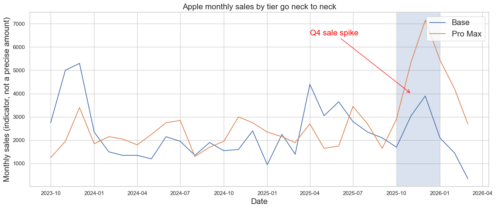
    


    
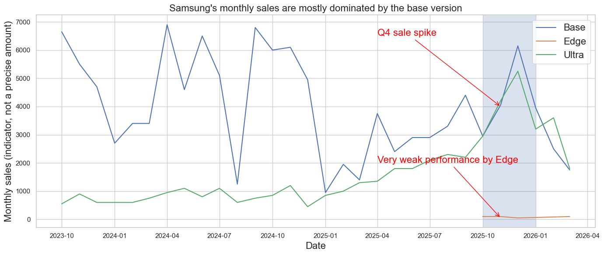
    


    
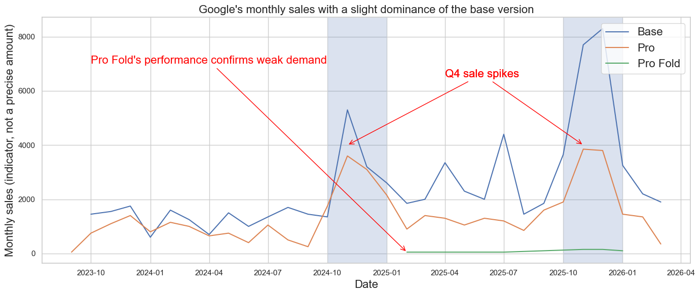
    


Dostępne okno danych jest dość krótkie, więc obserwacje należy traktować z pewną dozą ostrożności.

Tiery Pro Max i bazowy Apple'a naprzemiennie obejmują prowadzenie, do wyciągnięcia bardziej konkretnych obserwacji potrzebne byłoby dłuższe okno danych.

Model bazowy Samsunga prowadzi przez większość okresu, choć Ultra notuje wyraźny skok w Q4 2025.
Wariant Edge, już wcześniej oznaczony jako słaby pod kątem retencji ceny, potwierdza swoją niską pozycję również w danych sprzedażowych.

Modele Pro i bazowy Google'a idą łeb w łeb, co odpowiada niewielkim różnicom wykazanym przy analizie retencji ceny. 
Model bazowy mocno skacze w Q4 2025. Pro Fold konsekwentnie notuje niski wolumen, potwierdzając swój niszowy charakter i słaby popyt.

---
## Sprzedaż modeli bazowych Apple

Pora spojrzeć na sprzedaż modeli bazowych każdej marki i zobaczyć, czy widać wyraźne sezonowe wzorce i czy premiery nowych modeli mają jakiś wpływ na zachowanie starszych.


```python
submodel_ms_df = new_ms_df.groupby(['brand', 'submodel_name', 'tier', 'generation_name', 'month_year'])['monthly_sold'].sum().reset_index()
apple_base_ms_df = submodel_ms_df[(submodel_ms_df['brand'] == 'Apple') & (submodel_ms_df['tier'] == 'Base')]

fig, ax = plt.subplots(figsize=(14, 6))
sns.lineplot(data=apple_base_ms_df, x='month_year', y='monthly_sold', hue='generation_name', ax=ax)

ax.axvline(pd.Timestamp('2023-07-11'), color='purple', linestyle='--', linewidth=1.5, alpha=0.6, label='Prime Day (Jul)')
ax.axvline(pd.Timestamp('2023-09-15'), color='gray', linestyle='--', linewidth=1.5, alpha=0.6, label='iPhone Launch (Sep)')
ax.axvline(pd.Timestamp('2023-11-25'), color='orange', linestyle='--', linewidth=1.5, alpha=0.6, label='Black Friday (Nov)')
ax.axvline(pd.Timestamp('2023-12-20'), color='red', linestyle='--', linewidth=1.5, alpha=0.6, label='Christmas (Dec)')
for year in range(2024, 2026):
    ax.axvline(pd.Timestamp(f'{year}-07-11'), color='purple', linestyle='--', linewidth=1.5, alpha=0.6)
    ax.axvline(pd.Timestamp(f'{year}-09-15'), color='gray', linestyle='--', linewidth=1.5, alpha=0.6)
    ax.axvline(pd.Timestamp(f'{year}-11-25'), color='orange', linestyle='--', linewidth=1.5, alpha=0.6)
    ax.axvline(pd.Timestamp(f'{year}-12-20'), color='red', linestyle='--', linewidth=1.5, alpha=0.6)

handles, labels = ax.get_legend_handles_labels()
ax.legend(handles=handles, labels=labels, loc='upper right', fontsize=10)
ax.xaxis.set_major_formatter(mdates.DateFormatter('%b %Y'))
ax.set_title('Base iPhone sales over time (real dates)')
ax.set_xlabel('Date')
ax.set_ylabel('Monthly sales (indicator)')
ax.set_xlim(left=pd.Timestamp('2023-12-01'))

plt.annotate(
    text='iPhone 13 becomes the leader', fontsize = 14, color = 'red',
    xy=(pd.Timestamp('2024-11-01'), 750),
    xytext=(pd.Timestamp('2024-07-01'), 2500),
    arrowprops=dict(arrowstyle='->', color='red'),
)


plt.tight_layout()
plt.show()
```


    
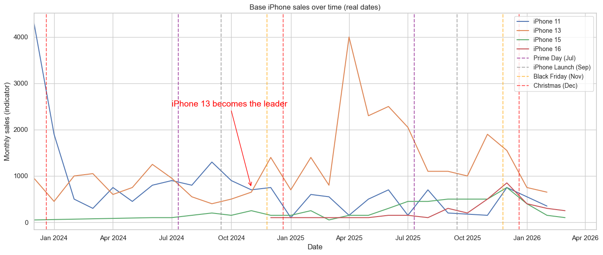
    


## iPhone 13: król rynku wtórnego
- iPhone 11 i 13 idą łeb w łeb przez cały 2024 rok. W 2025 sprzedaż iPhone'a 11 wyraźnie spada, a iPhone 13 wyraźnie pikuje, stając się niekwestionowanym liderem sprzedaży na rynku używanych iPhone'ów.

## Inne obserwacje

- Widać oznaki wzrostu sprzedaży iPhone'a 15 przed premierą iPhone'a 17, tuż przed Prime Day, choć nie jest to duży skok.
- Wzrost sprzedaży iPhone'a 16 bezpośrednio przed premierą iPhone'a 17 może być też efektem ogólnego wzrostu w Q4.

Dominacja iPhone'a 13 i skoki sprzedaży w Q4 są relatywnie wyraźnymi sygnałami, ale nawet je warto traktować z rezerwą, bo do potwierdzenia trendów potrzeba więcej danych.

---
## Sprzedaż submodeli iPhone'ów 11, 13 i 15

Mając obraz na poziomie generacji, czas zejść poziom niżej i sprawdzić, czy są jakieś różnice w sprzedaży poszczególnych tierów w różnych generacjach.


```python
iphone15_ms_df = submodel_ms_df[(submodel_ms_df['generation_name'] == 'iPhone 15') & (submodel_ms_df['tier'].isin(['Base', 'Pro Max']))]
iphone13_ms_df = submodel_ms_df[(submodel_ms_df['generation_name'] == 'iPhone 13') & (submodel_ms_df['tier'].isin(['Base', 'Pro Max']))]
iphone11_ms_df = submodel_ms_df[(submodel_ms_df['generation_name'] == 'iPhone 11') & (submodel_ms_df['tier'].isin(['Base', 'Pro Max']))]

def add_vlines(ax):
    ax.axvline(pd.Timestamp('2023-07-11'), color='purple', linestyle='--', linewidth=1.5, alpha=0.6, label='Prime Day (Jul)')
    ax.axvline(pd.Timestamp('2023-09-15'), color='gray', linestyle='--', linewidth=1.5, alpha=0.6, label='iPhone Launch (Sep)')
    ax.axvline(pd.Timestamp('2023-11-25'), color='orange', linestyle='--', linewidth=1.5, alpha=0.6, label='Black Friday (Nov)')
    ax.axvline(pd.Timestamp('2023-12-20'), color='red', linestyle='--', linewidth=1.5, alpha=0.6, label='Christmas (Dec)')
    for year in range(2024, 2026):
        ax.axvline(pd.Timestamp(f'{year}-07-11'), color='purple', linestyle='--', linewidth=1.5, alpha=0.6)
        ax.axvline(pd.Timestamp(f'{year}-09-15'), color='gray', linestyle='--', linewidth=1.5, alpha=0.6)
        ax.axvline(pd.Timestamp(f'{year}-11-25'), color='orange', linestyle='--', linewidth=1.5, alpha=0.6)
        ax.axvline(pd.Timestamp(f'{year}-12-20'), color='red', linestyle='--', linewidth=1.5, alpha=0.6)

for gen_df, title in [
    (iphone15_ms_df, 'iPhone 15 submodels'),
    (iphone13_ms_df, 'iPhone 13 submodels'),
    (iphone11_ms_df, 'iPhone 11 submodels'),
]:
    fig, ax = plt.subplots(figsize=(14, 6))
    sns.lineplot(data=gen_df, x='month_year', y='monthly_sold', hue='submodel_name', ax=ax)
    add_vlines(ax)
    handles, labels = ax.get_legend_handles_labels()
    ax.legend(handles=handles, labels=labels, bbox_to_anchor=(1.01, 1), loc='upper left', fontsize=8)
    ax.xaxis.set_major_formatter(mdates.DateFormatter('%b %Y'))
    ax.set_title(f'Sales: {title}')
    ax.set_xlabel('Date')
    ax.set_ylabel('Monthly sales (indicator)')
    ax.set_xlim(left=pd.Timestamp('2023-12-01'))
    plt.tight_layout()
    plt.show()
```


    
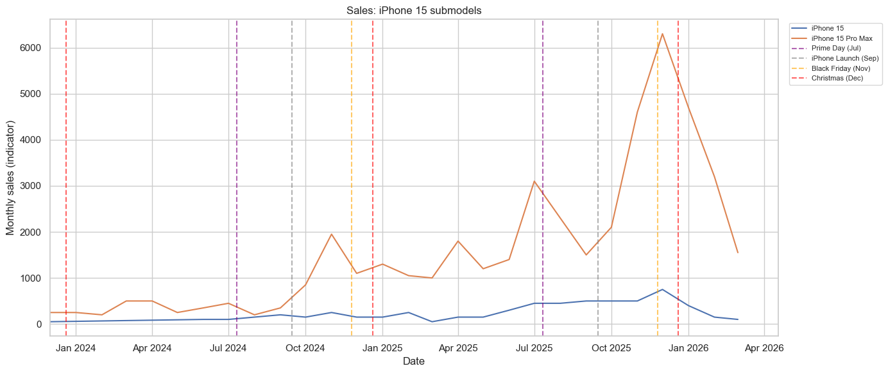
    


    
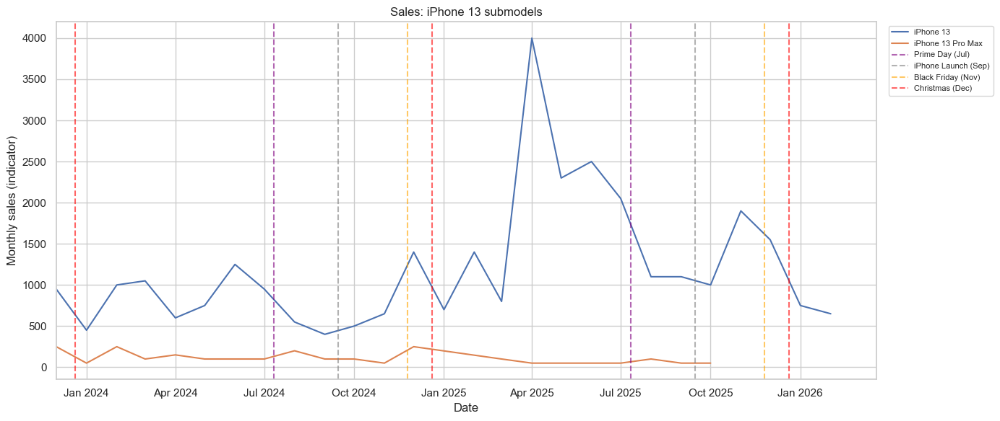
    


    
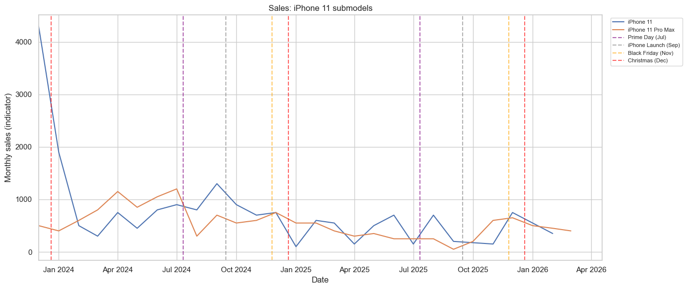
    


Różnice są tu znacznie wyraźniejsze i pozwalają sformułować nowe obserwacje.

## iPhone 15: dominacja Pro Maxa w drugim roku
Pro Max wykazuje sporą zmienność. Widać tu widoczny skok po premierze iPhone'a 16 (wrzesień 2024), i jeszcze większy wzrost po premierze 17 (wrzesień 2025). Kupujący zdają się czekać na koniec pierwszego roku, kiedy cena spada najmocniej, a premiera kolejnej generacji obniża ją jeszcze bardziej, tworząc dobry moment na zakup. Model bazowy iPhone'a 15 pozostaje względnie stabilny przez cały dostępny okres.

## iPhone 13: odwrócone role
Tu sytuacja jest odwrotna. Pro Max to stabilna kotwica, a model bazowy wyraźnie przoduje w sprzedaży i wykazuje dużo większą zmienność. Kupujący w tej generacji być może bardziej stawiają na koszty niż na możliwości flagowca.

## iPhone 11 jako przykład balansu
Model bazowy i Pro Max idą tu niemal łeb w łeb. Pamiętamy z analizy cenowej, że różnica cenowa kurczy się na końcu do okolic 100 USD, a Pro Max kosztuje blisko 300 USD. Przy takich cenach i różnicach dopłata za flagowiec staje się znacznie łatwiejszym wyborem.

---
# Kluczowe obserwacje

- **Marka Apple najlepiej utrzymuje wartość.** Pułap 50% pojawia się po raz pierwszy około 900 dni od premiery, a u konkurencji jest to około 500 dni dla Samsunga i 420 dla Google. Ta tendencja utrzymuje się przez cały cykl. Apple stabilizuje się średnio na poziomie 26-28% ceny premierowej, Samsung na około 16-17% a Google na pułapie 20%.

- **iPhone 13 to niekwestionowany król rynku wtórnego.** To najlepiej sprzedająca się generacja iPhone'a na rynku używanych telefonów na moment analizy.

- **Zakup 1-2 lata po premierze to świetna okazja.** Rok po premierze iPhone'y zachowują przeciętnie 70-75% ceny premierowej, a po dwóch latach około 50%. Technologia nie starzeje się znacznie przez ten okres czasu. Dane sprzedażowe, choć ograniczone, wydają się potwierdzać, że to realne okno zakupowe dla wielu osób, szczególnie w przypadku flagowców.

- **Niektóre niszowe warianty tracą wartość najszybciej.** Samsung Galaxy Edge i Google Pixel Pro Fold to przykłady komercyjnie nieudanych produktów. Oba notują jedne z najostrzejszych spadków w cenie i wyraźnie niski wolumen sprzedaży. Dokładne przyczyny są jedynie spekulacją i wymagałyby badań konsumenckich.

- **Starsze generacje kupują osoby szukające okazji.** W linii iPhone'a 13 to model bazowy prowadzi w sprzedaży, nie Pro Max. W przypadku iPhone'a 11, gdzie różnica cenowa mocno się skurczyła, Pro Max i model bazowy sprzedają się podobnie. Gdy dopłata za lepszy wariant staje się wystarczająco mała, kupujący po prostu sięgają po lepszy sprzęt.

- **Sprzedaż wszystkich marek zdaje się rosnąć w Q4.** Dla iPhone'ów koniec września przynosi premierę nowej generacji, po niej w listopadzie jest Black Friday i Boże Narodzenie w grudniu. Do potwierdzenia tego wzorca potrzeba jednak więcej obserwacji.
